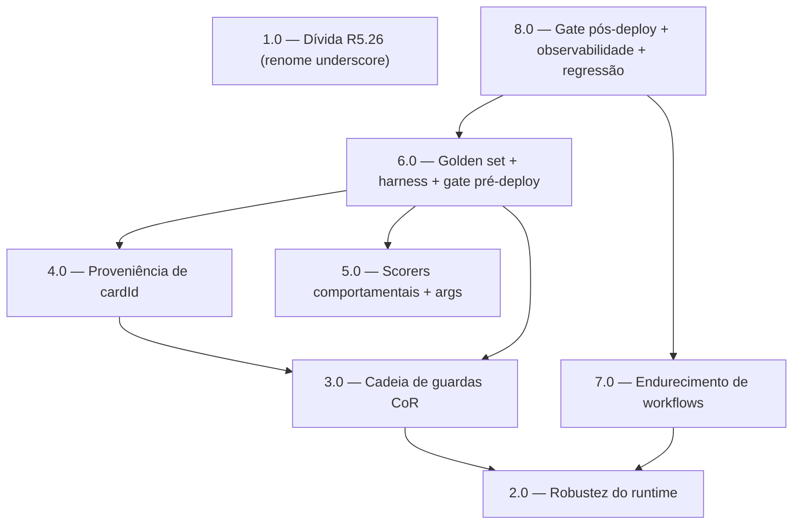

<!-- spec-hash-prd: 67713f8f900642b871bfc248104879765aa242954b30e5bb026527012c84a1e9 -->
<!-- spec-hash-techspec: 504838661670eab0f934b336e3d5aef5bfc2acaa2d466c943aed562bc2076f25 -->
# Resumo das Tarefas de Implementação para Orquestração Conversacional Confiável do Agente MeControla

## Metadados
- **PRD:** `.specs/prd-orquestracao-conversacional-confiavel/prd.md`
- **Especificação Técnica:** `.specs/prd-orquestracao-conversacional-confiavel/techspec.md`
- **Total de tarefas:** 8
- **Tarefas paralelizáveis:** 1.0‖2.0; 4.0‖5.0‖7.0

## Tarefas

| # | Título | Status | Dependências | Paralelizável | Skills |
|---|--------|--------|-------------|---------------|--------|
| 1.0 | Fechar dívida R5.26 (renome de identificadores `_`-prefixados) | pending | — | Com 2.0 | — |
| 2.0 | Robustez do runtime: truncamento, falha-segura e observabilidade | pending | — | Com 1.0 | mastra, domain-modeling-production |
| 3.0 | Cadeia de guardas conversacionais (Chain of Responsibility) | pending | 2.0 | Não | mastra, design-patterns-mandatory, domain-modeling-production |
| 4.0 | Proveniência determinística de cardId | pending | 3.0 | Com 5.0 | mastra |
| 5.0 | Scorers comportamentais + captura de args | pending | — | Com 4.0 | mastra |
| 6.0 | Golden set + harness em dois níveis + gate pré-deploy | pending | 3.0, 4.0, 5.0 | — | mastra |
| 7.0 | Endurecimento de workflows e pendências (integração) | pending | 2.0 | Com 4.0, 5.0 | mastra, postgresql-production-standards |
| 8.0 | Gate pós-deploy + observabilidade + contrato de regressão | pending | 6.0, 7.0 | — | postgresql-production-standards, otel-grafana-dashboards |

## Dependências Críticas
- Caminho crítico: **2.0 → 3.0 → {4.0, 5.0} → 6.0 → 8.0**.
- 3.0 (cadeia de guardas) depende de 2.0 porque os handlers pós-LLM de resposta-vazia/fallback usam o
  tratamento de falha-segura introduzido no runtime.
- 4.0 (cardId) depende de 3.0 porque o handler `card_provenance` é um `PostGuard` da cadeia.
- 6.0 (golden/harness) depende de 3.0, 4.0 e 5.0 porque valida a cadeia, a proveniência de cartão e os
  scorers no agente completo.
- 8.0 (gate pós-deploy) depende de 6.0 e 7.0 porque consome scorers em produção, golden e workflows
  endurecidos.

## Riscos de Integração
- **Alteração aditiva em `internal/platform/agent`** (2.0): risco de tocar substrato; mitigado por serem
  extensões aditivas (novo `ToolOutcome`, novos ramos de observação) sem alterar contrato público, com o
  kernel `internal/platform/workflow` intocado (R-WF-KERNEL-001 preservado).
- **Override pós-LLM (3.0)** pode regredir fluidez de respostas válidas; mitigado por handlers agirem só
  sobre violação inequívoca + golden de regressão (6.0).
- **`ScoringHooks.AfterTool` descarta args hoje** (5.0): pré-requisito para scorers de argumento; se não
  corrigido, `required_args`/`month_reference_correctness` ficam cegos.
- **Harness real-LLM (6.0)** tem variância; mitigado por gate por ratio agregado por categoria ≥ 0,90 com
  invariante semântico, não assert de keyword estreita.
- **Contagem de 8 tarefas** dentro do limite default (10); a tarefa 8.0 concentra gate + observabilidade
  + regressão como fatia coerente de "production hardening".

## Cobertura de Requisitos

| Tarefa | Requisitos cobertos |
|--------|-------------------|
| 1.0 | RF-44 |
| 2.0 | RF-22, RF-23, RF-24, RF-25, RF-26, RF-27, RF-28, RF-33, RF-47 |
| 3.0 | RF-01, RF-02, RF-03, RF-04, RF-05, RF-06, RF-09, RF-10, RF-11, RF-12, RF-48 |
| 4.0 | RF-16, RF-17, RF-18 |
| 5.0 | RF-19, RF-20, RF-21, RF-29, RF-30, RF-31, RF-32, RF-34 |
| 6.0 | RF-07, RF-08, RF-35, RF-36, RF-37, RF-38, RF-39, RF-40, RF-41 |
| 7.0 | RF-13, RF-14, RF-15, RF-45, RF-46 |
| 8.0 | RF-42, RF-43, RF-49, RF-50, RF-51, RF-52, RF-53, RF-54, RF-55, RF-56, RF-57 |

## Grafo de Dependencias

## Legenda de Status
- `pending`: aguardando execução
- `in_progress`: em execução
- `needs_input`: aguardando informação do usuário
- `blocked`: bloqueado por dependência ou falha externa
- `failed`: falhou após limite de remediação
- `done`: completado e aprovado
