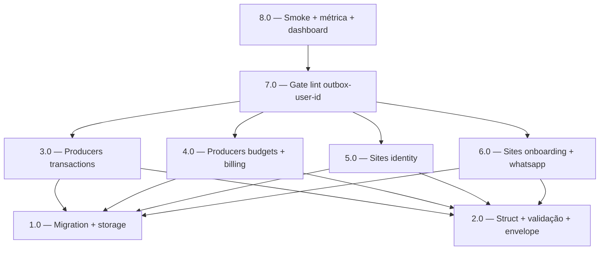

<!-- spec-hash-prd: c3f28341962b9b41d0ef93c214d36f501fdd68c74b8fede2e55da20081128b64 -->
<!-- spec-hash-techspec: 2b9bd001c962b404f33684bf32899781aeb71f8e8e5b61bd9ba604de12c81c36 -->
# Resumo das Tarefas de Implementação para Outbox Aggregate User ID Top-Level

## Metadados
- **PRD:** `.specs/prd-outbox-aggregate-user-id/prd.md`
- **Especificação Técnica:** `.specs/prd-outbox-aggregate-user-id/techspec.md`
- **Total de tarefas:** 8
- **Tarefas paralelizáveis:** 1.0 ‖ 2.0; 3.0 ‖ 4.0 ‖ 5.0 ‖ 6.0

## Tarefas

| # | Título | Status | Dependências | Paralelizável | Skills |
|---|--------|--------|-------------|---------------|--------|
| 1.0 | Migration 000017 + storage_postgres (Insert/ClaimBatch) | done | — | Com 2.0 | — |
| 2.0 | outbox.Event/EventInput + NewEvent + Pack + allowlist + métrica | done | — | Com 1.0 | — |
| 3.0 | Atualizar 3 producers de transactions | done | 1.0, 2.0 | Com 4.0, 5.0, 6.0 | — |
| 4.0 | Atualizar producers de budgets + billing | done | 1.0, 2.0 | Com 3.0, 5.0, 6.0 | — |
| 5.0 | Atualizar 3 sites de identity (use cases + module) | done | 1.0, 2.0 | Com 3.0, 4.0, 6.0 | — |
| 6.0 | Atualizar 3 sites de onboarding + dispatcher whatsapp | done | 1.0, 2.0 | Com 3.0, 4.0, 5.0 | — |
| 7.0 | Gate lint:outbox-user-id + receita Taskfile | done | 3.0, 4.0, 5.0, 6.0 | Não | taskfile-production |
| 8.0 | Smoke staging + métrica + dashboard auth-module | done | 7.0 | Não | otel-grafana-dashboards |

## Dependências Críticas
- **2.0 (struct/validação) é gate**: 3.0–6.0 importam `outbox.EventInput` com campo novo; sem 2.0, nada compila.
- **1.0 (migration) é gate operacional**: deploy do código com 3.0–6.0 sem migration em produção causa `column doesn't exist`. Pipeline `task migrate:up && task deploy` atômico (ADR-002).
- **7.0 só faz sentido após todos os callers (3.0–6.0)**: senão o gate falsa-positiva nos PRs intermediários. Por isso depende dos 4.
- **Rollout atômico (ADR-002)**: 1.0–7.0 podem ser um único PR grande, ou PRs adjacentes mergeados na mesma janela. Sem dual-write, sem feature flag.

## Riscos de Integração
- **Mocks de `outbox.Publisher` em consumers**: após 2.0, `task mocks` precisa regenerar mocks que usam `outbox.Event`. Verificar `outbox.Publisher` em testes.
- **Tabela `outbox_events` com volume**: migration `ADD COLUMN UUID NULL` em Postgres é metadata-only (instantânea). Index criado com `CONCURRENTLY` para zero lock.
- **Producers que herdam de mesmo helper**: alguns módulos podem ter helper local (e.g. `newOutboxEvent`); verificar e atualizar em 1 lugar quando possível.
- **`outbox_events` em testes integration de outros módulos**: testes que assertam linha completa do envelope podem falhar com campo novo. Auditar.

## Cobertura de Requisitos

| Tarefa | Requisitos cobertos |
|--------|-------------------|
| 1.0 | RF-01, RF-02, RF-03, RF-11, RF-12, RF-13 |
| 2.0 | RF-04, RF-05, RF-06, RF-07, RF-08, RF-09, RF-10, RF-15 |
| 3.0 | RF-14 (transactions: transaction, card_purchase, recurring_template) |
| 4.0 | RF-14 (budgets: expense_committed; billing: subscription_event) |
| 5.0 | RF-14 (identity: establish_principal, mark_user_deleted, module) |
| 6.0 | RF-14 (onboarding: subscription_binding, subscription_bound, module; whatsapp: dispatcher) |
| 7.0 | RF-16, RF-17 |
| 8.0 | RF-18, RF-19, RF-20 (validações + dashboard) |

## Grafo de Dependencias

## Legenda de Status
- `pending`: aguardando execução
- `in_progress`: em execução
- `needs_input`: aguardando informação do usuário
- `blocked`: bloqueado por dependência ou falha externa
- `failed`: falhou após limite de remediação
- `done`: completado e aprovado
