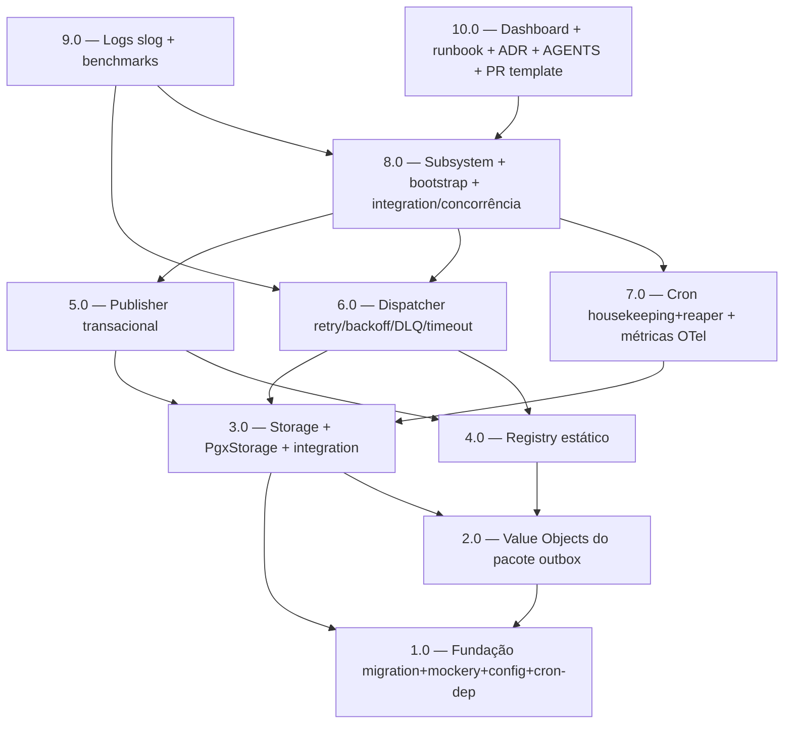

<!-- spec-hash-prd: d87cd9fb18697e38e526c80ad8f8a6f474ff01306f5bbf0bbe3c127c79d225f2 -->
<!-- spec-hash-techspec: ae6b6ca92511186afd50cd37d775c289f4e8294fc903286bb77f8c5803209f18 -->
# Resumo das Tarefas de Implementação para Outbox Transacional (Publisher Opt-in)

## Metadados
- **PRD:** `.specs/prd-outbox-event-driven/prd.md`
- **Especificação Técnica:** `.specs/prd-outbox-event-driven/techspec.md`
- **Total de tarefas:** 10
- **Tarefas paralelizáveis:** 3.0‖4.0, 5.0‖6.0, 7.0‖5.0,6.0

## Tarefas

| # | Título | Status | Dependências | Paralelizável | Skills |
|---|--------|--------|-------------|---------------|--------|
| 1.0 | Fundação — migration 0002_outbox, mockery.yml, OutboxConfig e dep cron/v3 | done | — | — | taskfile-production |
| 2.0 | Value Objects e tipos de domínio do pacote outbox | done | 1.0 | Não | — |
| 3.0 | Porta Storage + adapter PgxStorage + integration tests + mocks | done | 1.0, 2.0 | Com 4.0 | — |
| 4.0 | Registry estático com validação de duplicidade | done | 2.0 | Com 3.0 | — |
| 5.0 | Publisher transacional opt-in | done | 3.0, 4.0 | Com 6.0, 7.0 | — |
| 6.0 | Dispatcher com retry, backoff, DLQ e timeout | done | 3.0, 4.0 | Com 5.0, 7.0 | — |
| 7.0 | Cron (housekeeping + reaper), métricas OTel e traces | done | 3.0 | Com 5.0, 6.0 | — |
| 8.0 | Subsystem agregador, bootstrap no cmd/worker e suites integration/concorrência | done | 5.0, 6.0, 7.0 | Não | — |
| 9.0 | Logs slog sem payload com allowlist e benchmarks de publish/dispatcher | done | 6.0, 8.0 | Não | — |
| 10.0 | Dashboard Grafana, runbook, ADR-016, AGENTS/CLAUDE, módulo AGENTS e PR template | done | 8.0 | Não | otel-grafana-dashboards |

## Dependências Críticas
- 1.0 é fundação obrigatória: migration, `mockery.yml`, `OutboxConfig` e pin `robfig/cron/v3@v3.0.1` precisam estar mergeáveis antes de qualquer código de domínio.
- 2.0 entrega os Value Objects sem dependência de pgx/otel; bloqueia 3.0, 4.0, 5.0, 6.0.
- 3.0 (Storage/PgxStorage) é caminho crítico SQL — bloqueia 5.0 (Publisher), 6.0 (Dispatcher) e 7.0 (Cron/reaper/housekeeping).
- 4.0 (Registry) bloqueia 5.0 (Publisher consulta `SubscriptionsFor`) e 6.0 (Dispatcher hidrata handler por subscription).
- 8.0 só pode iniciar após 5.0+6.0+7.0 verdes — é o ponto de integração final do `outbox.Subsystem` + `runtime.Subsystem` no `cmd/worker`.
- 10.0 (docs + governança + rollout) fecha o ciclo após 8.0 (integration concreta validada) — o runbook e a ADR referenciam comportamento já demonstrado.

## Riscos de Integração
- **Coordenação multi-instância (FOR UPDATE SKIP LOCKED)**: confirmado em 3.0 (integration), revalidado em 8.0 (concurrency com 3 dispatchers) — qualquer regressão em 3.0 invalida 8.0.
- **Subsystem `Stop(ctx)` drenando handlers in-flight**: cruza 6.0 (Dispatcher WaitGroup) e 8.0 (Subsystem `errors.Join`); teste de Stop com handler em execução é critério de pronto de 8.0.
- **+1 INSERT por handler na transação do agregado**: 5.0 instrumenta; 9.0 mede via benchmark; comparação contra baseline antes do go-live é critério de 9.0.
- **`OUTBOX_DISPATCHER_ENABLED=false` no boot**: 1.0 define o flag, 6.0/8.0 garantem que loop não inicia e Publisher continua escrevendo; runbook de rollback em 10.0 documenta o ciclo.
- **`cron.Stop(ctx)` espera jobs in-flight**: 7.0 + 8.0 — usar `select { <-cron.Stop(ctx).Done(): ; <-ctx.Done(): }` para não estourar deadline de shutdown.
- **`mockery.yml` inexistente hoje (D-16)**: 1.0 cria o arquivo; 3.0 depende dele para gerar mocks de `Storage`/`Registry`.

## Cobertura de Requisitos

| Tarefa | Requisitos cobertos |
|--------|---------------------|
| 1.0 | RF-26, RF-28 |
| 2.0 | RF-03, RF-13 |
| 3.0 | RF-04, RF-10, RF-14, RF-15 |
| 4.0 | RF-06, RF-07, RF-08 |
| 5.0 | RF-01, RF-02, RF-05 |
| 6.0 | RF-11, RF-12, RF-15, RF-33 |
| 7.0 | RF-18, RF-19, RF-20, RF-21, RF-22 |
| 8.0 | RF-09, RF-34, RF-35, RF-39 |
| 9.0 | RF-23, RF-24, RF-31, RF-36 |
| 10.0 | RF-05, RF-16, RF-17, RF-25, RF-27, RF-29, RF-30, RF-32, RF-37, RF-38, RF-40 |

## Grafo de Dependencias

## Legenda de Status
- `pending`: aguardando execução
- `in_progress`: em execução
- `needs_input`: aguardando informação do usuário
- `blocked`: bloqueado por dependência ou falha externa
- `failed`: falhou após limite de remediação
- `done`: completado e aprovado
