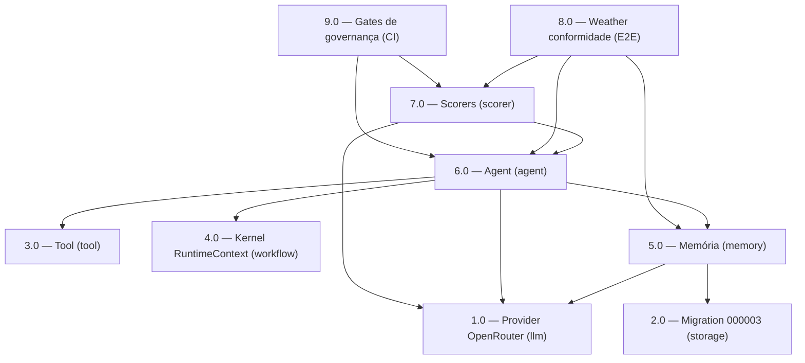

<!-- spec-hash-prd: 6b96b1c597b7039ee9388e726e1b5a64d69bb0772db6509ad4c26d759a8dfaba -->
<!-- spec-hash-techspec: 6818741ad0f1c991476aac3b7a6beb5a19ca1866a16f867c836ae7949cb64c69 -->
# Resumo das Tarefas de Implementação para Plataforma Mastra-paridade em `internal/platform`

## Metadados
- **PRD:** `.specs/prd-platform-mastra/prd.md`
- **Especificação Técnica:** `.specs/prd-platform-mastra/techspec.md`
- **Total de tarefas:** 9
- **Tarefas paralelizáveis:** 1.0, 2.0, 3.0, 4.0 (fundação); 8.0 com 9.0

## Tarefas

<!-- Colunas e formato canônico (MANDATÓRIO):
     - `#`: id decimal `X.Y` (sempre X.0 para tarefas de topo).
     - `Status`: ^(pending|in_progress|needs_input|blocked|failed|done)$
     - `Dependências`: ^(—|\d+\.\d+(,\s*\d+\.\d+)*)$  (em-dash unicode quando vazio)
     - `Paralelizável`: ^(—|Não|Com\s+\d+\.\d+(,\s*\d+\.\d+)*)$
     - `Skills`: skills processuais extras (descoberta agnóstica em `.agents/skills/`). Use `—` quando
       não houver. Nunca listar skills auto-carregadas (governance/linguagem) nem `*-implementation`.
     - `Fase` (OPCIONAL): inteiro positivo para agrupamento visual de fases de entrega. Pode ser
       omitida em PRDs pequenos; `execute-all-tasks` não consome esta coluna. Se incluída, mantenha
       em todas as linhas para não quebrar o parser de tabela markdown. -->

| # | Título | Status | Dependências | Paralelizável | Skills |
|---|--------|--------|-------------|---------------|--------|
| 1.0 | Provider OpenRouter genérico em `internal/platform/llm` (Complete, Stream SSE, Embed, structured output injetável) | done | — | Com 2.0, 3.0, 4.0 | go-implementation, mastra |
| 2.0 | Migration `000003` — DROP `agent_*`, storage genérico `platform_*` + `vector(1536)`/HNSW, down simétrico | done | — | Com 1.0, 3.0, 4.0 | go-implementation |
| 3.0 | Contrato de Tool em `internal/platform/tool` (`ToolHandle`, `NewTool[I,O]`, `Registry`) | done | — | Com 1.0, 2.0, 4.0 | go-implementation, mastra |
| 4.0 | Evolução mínima do kernel `internal/platform/workflow` (RuntimeContext via context; agent-como-step) | done | — | Com 1.0, 2.0, 3.0 | go-implementation, mastra |
| 5.0 | Memória em `internal/platform/memory` (Thread/Message/WorkingMemory + SemanticRecall pgvector + indexação assíncrona) | done | 1.0, 2.0 | — | go-implementation, mastra |
| 6.0 | Primitivo Agent em `internal/platform/agent` (AgentRuntime Thread→Run, Execute+Stream, hooks, structured output, RuntimeContext) | done | 1.0, 3.0, 4.0, 5.0 | — | go-implementation, mastra |
| 7.0 | Scorers/Evals em `internal/platform/scorer` (code-based + LLM-judged, Sampling, runner assíncrono, persistência) | done | 1.0, 6.0 | — | go-implementation, mastra |
| 8.0 | Consumidor de referência `test/conformance/weather` + suite de conformidade (unit/integração/E2E `RUN_REAL_LLM`) | done | 5.0, 6.0, 7.0 | Com 9.0 | go-implementation, mastra |
| 9.0 | Reemissão dos gates de governança no CI/Taskfile (import, LLM, comentários, cardinalidade, tipos fechados) | done | 6.0, 7.0 | Com 8.0 | taskfile-production |

## Dependências Críticas
- `internal/platform/llm` (1.0) é base de tudo que usa LLM/embeddings: bloqueia 5.0, 6.0, 7.0.
- Migration `000003` (2.0) cria o schema `platform_*` + `vector`: bloqueia a integração de 5.0 (memory) e 6.0 (agent runs).
- Memória (5.0) é dependência do Agent (6.0) para binding de memory/working memory/recall.
- Agent (6.0) é dependência do Scorer (7.0, observa runs) e do consumidor de referência (8.0).
- Caminho crítico: (1.0,2.0) → 5.0 → 6.0 → 7.0 → 8.0; 9.0 fecha o enforcement após 6.0/7.0.

## Riscos de Integração
- Streaming × structured output: validação só na conclusão do stream (ADR-003); risco de regressão se 6.0 expuser structured parcial — gate de teste fim-de-stream obrigatório.
- pgvector ausente no ambiente bloqueia 2.0/5.0; mitigado por `CREATE EXTENSION IF NOT EXISTS vector`, Dockerfile.postgres e testcontainers `pgvector/pgvector:pg16` (ADR-004/005).
- Layering: risco do kernel (4.0) importar camada superior; gate grep em 9.0 e em cada tarefa.
- Indexação assíncrona (5.0) via outbox/worker: risco de leak de goroutine/duplicação; idempotência por `event_id` e shutdown cooperativo obrigatórios.
- Migration down (2.0) deve recriar as 7 `agent_*` (copiar DDL de `000001`) para reversibilidade real.

## Cobertura de Requisitos

| Tarefa | Requisitos cobertos |
|--------|-------------------|
| 1.0 | RF-04, RF-05, RF-06 |
| 2.0 | RF-35, RF-36, RF-37, RF-38, RF-39 |
| 3.0 | RF-09, RF-10 |
| 4.0 | RF-11, RF-12, RF-13, RF-14, RF-26, RF-27 |
| 5.0 | RF-15, RF-16, RF-17, RF-18, RF-19, RF-20, RF-21, RF-22, RF-23, RF-24, RF-25 |
| 6.0 | RF-01, RF-02, RF-03, RF-07, RF-08, RF-26, RF-27, RF-28, RF-29, RF-30, RF-31, RF-32, RF-33, RF-34 |
| 7.0 | RF-40, RF-41, RF-42, RF-43 |
| 8.0 | RF-44, RF-45, RF-46 |
| 9.0 | RF-31, RF-32, RF-33, RF-34 |

## Grafo de Dependencias

## Legenda de Status
- `pending`: aguardando execução
- `in_progress`: em execução
- `needs_input`: aguardando informação do usuário
- `blocked`: bloqueado por dependência ou falha externa
- `failed`: falhou após limite de remediação
- `done`: completado e aprovado
