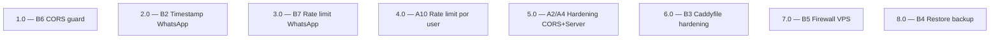

<!-- spec-hash-prd: 46b7d3b20fe8bb169b87b9034e80bb8ce7df9cf79b94745d9a14b4b57d90183b -->
<!-- spec-hash-techspec: 726d3582af6a095c9e5632486cd1609bbc43a0f00b96038ba875180c38611ee8 -->
# Resumo das Tarefas de Implementação para Pre Go-Live Hardening

## Metadados
- **PRD:** `.specs/prd-pre-golive-hardening/prd.md`
- **Especificação Técnica:** `.specs/prd-pre-golive-hardening/techspec.md`
- **Total de tarefas:** 8
- **Tarefas paralelizáveis:** 1.0–5.0 (Go) ‖ 6.0–8.0 (infra/ops)

## Tarefas

| # | Título | Status | Dependências | Paralelizável | Skills |
|---|--------|--------|-------------|---------------|--------|
| 1.0 | B6 — CORS guard em Config.Validate | done | — | Com 2.0, 3.0, 4.0, 5.0 | — |
| 2.0 | B2 — Timestamp WhatsApp anti-replay | done | — | Com 1.0, 3.0, 4.0, 5.0 | — |
| 3.0 | B7 — Rate limit webhook WhatsApp | done | — | Com 1.0, 2.0, 4.0, 5.0 | — |
| 4.0 | A10 — Rate limit por user_id em rotas autenticadas | done | — | Com 1.0, 2.0, 3.0, 5.0 | — |
| 5.0 | A2/A4 — Hardening fallback CORS + Server header | done | — | Com 1.0, 2.0, 3.0, 4.0 | — |
| 6.0 | B3 — Caddyfile hardening (TLS + headers + strip + admin block) | done | — | Com 7.0, 8.0 | — |
| 7.0 | B5 — Firewall VPS ufw + SSH hardening | done | — | Com 6.0, 8.0 | taskfile-production |
| 8.0 | B4 — Restore de backup automatizado + cron staging | done | — | Com 6.0, 7.0 | taskfile-production |

## Dependências Críticas
- **Cutover coordenado para 6.0**: deploy do Caddyfile precisa coincidir com deploy de B1 (`.specs/prd-gateway-auth-forensics/`) para que o strip de `X-User-ID`/`X-Gateway-Auth` no Caddy + enforcement no app aconteçam juntos. Coordenar.
- **1.0 (CORS guard) bloqueia deploy se `.env` em produção estiver com `*` ou vazio**: aplicar `.env` correto antes do deploy do app.
- **5.0 (A2/A4) tangencia 1.0 (B6)** — depende da existência do guard de Validate para garantir que fallback no `cmd/server/server.go` nunca retorne `*` em production. Implementar 1.0 primeiro se houver conflito de PR.
- **7.0 + 8.0 são pré-requisitos operacionais de go-live**: sem firewall + restore validado, o servidor não deve ir para produção mesmo com app verde.

## Riscos de Integração
- **Caddyfile drift**: se a topologia atual deploy/compose for diferente do esperado, RF-07 (bloqueio de `/metrics`) pode quebrar scraping Prometheus. Verificar rede `backend` antes do deploy.
- **Tabela `auth_events` CHECK constraint**: B2 (RF-02, RF-03) adiciona `reason="stale_webhook"` e `reason="invalid_webhook_timestamp"`. Coordenar com migration `000015` do PRD gateway-auth-forensics que também amplia o CHECK — uma migration única que cobre todos os reasons novos é preferível para evitar conflito.
- **Generalização do `rate_limit.go` (A10)**: refactor pode quebrar uso atual em onboarding. Cobrir com testes do extractor `ByIP` antes de adicionar `ByUserID`.

## Cobertura de Requisitos

| Tarefa | Requisitos cobertos |
|--------|-------------------|
| 1.0 | RF-18, RF-19, RF-20, RF-32, RF-33, RF-34 |
| 2.0 | RF-01, RF-02, RF-03, RF-04, RF-05, RF-32, RF-33, RF-34 |
| 3.0 | RF-21, RF-22, RF-23, RF-24, RF-32, RF-33, RF-34 |
| 4.0 | RF-27, RF-28, RF-29, RF-30, RF-31, RF-32, RF-33, RF-34 |
| 5.0 | RF-25, RF-26, RF-32, RF-33, RF-34 |
| 6.0 | RF-06, RF-07, RF-08, RF-09, RF-10 |
| 7.0 | RF-15, RF-16, RF-17 |
| 8.0 | RF-11, RF-12, RF-13, RF-14 |

## Grafo de Dependencias

## Legenda de Status
- `pending`: aguardando execução
- `in_progress`: em execução
- `needs_input`: aguardando informação do usuário
- `blocked`: bloqueado por dependência ou falha externa
- `failed`: falhou após limite de remediação
- `done`: completado e aprovado
