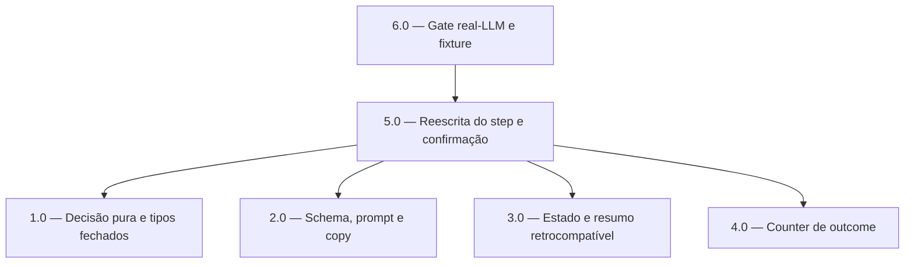

<!-- spec-hash-prd: 7d6202635134d884361f8109f89e510aa45fe46184c15f6744f3a017437bba03 -->
<!-- spec-hash-techspec: 157840c9e3e3bd9d68a8c05217a2af9d2e05591bf15c2fe4340816e8bf228bbb -->
# Resumo das Tarefas de Implementação para Recorrência do Orçamento por Linguagem Natural no Onboarding

## Metadados
- **PRD:** `.specs/prd-recorrencia-orcamento-onboarding/prd.md`
- **Especificação Técnica:** `.specs/prd-recorrencia-orcamento-onboarding/techspec.md`
- **Total de tarefas:** 6
- **Tarefas paralelizáveis:** nenhuma (todas editam `internal/agents/application/workflows/onboarding_workflow.go`; execução sequencial obrigatória para evitar conflito no mesmo arquivo)

## Tarefas

| # | Título | Status | Dependências | Paralelizável | Skills |
|---|--------|--------|-------------|---------------|--------|
| 1.0 | Decisão pura `DecideRecurrence` e tipos-estado fechados | done | — | — | domain-modeling-production, design-patterns-mandatory |
| 2.0 | Schema dedicado, prompt e copy no Tom de Voz | done | — | Não | mastra |
| 3.0 | Estado com meses e resumo retrocompatível | done | — | Não | mastra, domain-modeling-production |
| 4.0 | Counter de outcome do step de recorrência | done | — | Não | mastra |
| 5.0 | Reescrita do `BuildRecurrenceStep` e confirmação encadeada | done | 1.0, 2.0, 3.0, 4.0 | Não | mastra |
| 6.0 | Gate real-LLM com 0 falso-sucesso e fixture full-flow | done | 5.0 | — | mastra |

## Dependências Críticas
- 5.0 depende de 1.0 (decisão pura/tipos), 2.0 (schema/prompt/copy), 3.0 (campos de estado/resumo) e 4.0 (counter) — o step só é reescrito quando todos os blocos que ele consome existem.
- 6.0 depende de 5.0 — o gate real-LLM exercita o step já reescrito.
- Todas as tarefas tocam `onboarding_workflow.go`; a ordem 1.0 → 2.0 → 3.0 → 4.0 → 5.0 → 6.0 é obrigatória para evitar conflito de edição no mesmo arquivo (nenhuma paralelização de execução).

## Riscos de Integração
- `recurrenceSchema` é compartilhado com o passo `summary_confirm` do budget review (`onboarding_workflow.go:1480`). Tarefa 2.0 DEVE criar schema/struct novos (`recurrenceDecisionSchema`/`recurrenceExtract`) e NÃO alterar `recurrenceSchema`/`yesNoExtract`/`summaryConfirmSystemPrompt`.
- 8 pontos de teste existentes mudam por design (prompt inicial `:2938`, mock 12 `:2959`, ambíguo `:2994-3016`, resumo `:3557/:3593`, surface map `:3869/:3876`, assinatura `:3048`, fixture full-flow WhatsApp `:332/342`, assinatura gate `:716`). Distribuídos entre 3.0, 5.0 e 6.0.
- O step DEVE manter uma única chamada `agent.Execute` por turno para preservar a contagem `.Once()` do teste full-flow (2.0/5.0/6.0).
- Domínio `internal/budgets` é reaproveitado sem alteração (suporte 1–12 já ponta a ponta); nenhuma tarefa toca esse módulo.

## Cobertura de Requisitos

| Tarefa | Requisitos cobertos |
|--------|-------------------|
| 1.0 | RF-01, RF-02, RF-03, RF-04, RF-06, RF-07, RF-08, RF-17 |
| 2.0 | RF-04, RF-05, RF-07, RF-08, RF-14, RF-15 |
| 3.0 | RF-11, RF-13, RF-20 |
| 4.0 | RF-16 |
| 5.0 | RF-01, RF-02, RF-03, RF-07, RF-08, RF-09, RF-10, RF-12, RF-18, RF-19 |
| 6.0 | RF-17, RF-18 |

## Grafo de Dependencias

## Legenda de Status
- `pending`: aguardando execução
- `in_progress`: em execução
- `needs_input`: aguardando informação do usuário
- `blocked`: bloqueado por dependência ou falha externa
- `failed`: falhou após limite de remediação
- `done`: completado e aprovado
