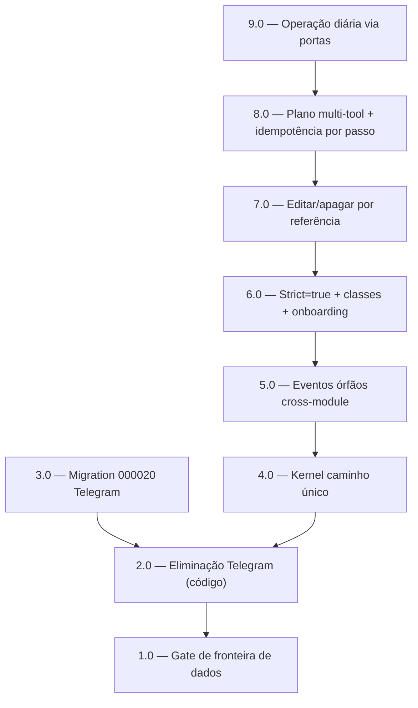

<!-- spec-hash-prd: 96940ca79c35758e9004066b267dbad5f723f9e453eb66fa3714f568b993dab9 -->
<!-- spec-hash-techspec: 0f5d19678dfb48b4aea5830ea454b997aef5259ae0c8dfbdc2ef521c96a48c06 -->
# Resumo das Tarefas de Implementação para Refatoração Canônica do `internal/agent`

## Metadados
- **PRD:** `.specs/prd-refatoracao-agent-canonico/prd.md`
- **Especificação Técnica:** `.specs/prd-refatoracao-agent-canonico/techspec.md`
- **Total de tarefas:** 9
- **Tarefas paralelizáveis:** nenhuma (sequência linear — ver Riscos de Integração)

## Tarefas

| # | Título | Status | Dependências | Paralelizável | Skills |
|---|--------|--------|-------------|---------------|--------|
| 1.0 | Gate de fronteira de dados + gates de governança | done | — | — | mastra |
| 2.0 | Eliminação do canal Telegram (código + config) | done | 1.0 | Não | mastra |
| 3.0 | Migration 000020 drop Telegram (schema) + verificação pré-deploy | done | 2.0 | Não | — |
| 4.0 | Kernel caminho único: remover legacy + fallback morto | done | 2.0 | Não | mastra |
| 5.0 | Limpeza de eventos órfãos cross-module | done | 4.0 | Não | mastra |
| 6.0 | Structured Output Strict=true + roteamento por classe + onboarding json_schema | done | 5.0 | Não | mastra |
| 7.0 | Editar/apagar por referência + desambiguação (search + HITL) | done | 6.0 | Não | mastra |
| 8.0 | Plano multi-tool 1..N + idempotência por passo (migration 000021) | done | 7.0 | Não | mastra |
| 9.0 | Operação diária via portas (recorrência, % categoria, consultas, casos especiais) | done | 8.0 | Não | mastra |

## Dependências Críticas
- **1.0 → tudo:** o gate de fronteira de dados é a blindagem; deve estar verde antes de qualquer refatoração do agent.
- **2.0 → 3.0:** o código Telegram deve ser removido antes do schema (migration ALTER), senão referências quebram.
- **2.0 → 4.0:** kernel-único e Telegram tocam `module.go`/`daily_ledger_agent.go`; serializar evita conflito.
- **4.0 (PRÉ-1..PRÉ-4) é bloqueante para remover o legacy** (ADR-006): kernel sempre-on + drenar drafts + parity verde antes da remoção.
- **6.0 → 7.0 → 8.0:** by-ref e plano dependem do schema de parse (kinds/plan) e do kernel-único; o plano reusa o `destructive_confirm` da 7.0.
- **3.0 (000020) e 8.0 (000021):** migrations distintas; 000021 (step_index) deve preceder a habilitação de planos multi-escrita.

## Riscos de Integração
- **Arquivos compartilhados de alto contágio:** `internal/agent/module.go`, `application/services/daily_ledger_agent.go`, `application/services/agent_workflows.go` (seam `buildRegistry`) e `application/usecases/parse_inbound.go` são tocados por várias tarefas. Por isso a sequência é **linear, sem paralelismo** — paralelizar esconderia risco de merge/integração e violaria "0 gaps".
- **Migração do onboarding (tool-calling → json_schema, ADR-003):** reescreve fluxo que já funciona; exige paridade de etapas do Documento Oficial + guard real-LLM antes do cutover.
- **Premissa zero usuários Telegram (000020):** verificação pré-deploy fail-fast; se contagem > 0, abortar.
- **Strict=true exclui modelos:** guard real-LLM por classe antes de promover primário; onboarding deixa haiku.
- **Bug latente edit-last (`NewAmount` não preenchido):** corrigido na 7.0 junto com by-ref.
- **Justificativa de >0 paralelismo:** nenhuma — opção consciente por robustez/0 gaps sobre velocidade.

## Cobertura de Requisitos

| Tarefa | Requisitos cobertos |
|--------|-------------------|
| 1.0 | RF-20, RF-43, RF-44, RF-45 |
| 2.0 | RF-01, RF-02, RF-03, RF-04, RF-06 |
| 3.0 | RF-05, RF-42 |
| 4.0 | RF-39, RF-40 |
| 5.0 | RF-41 |
| 6.0 | RF-07, RF-08, RF-11, RF-13, RF-14, RF-15, RF-16, RF-17, RF-18, RF-19, RF-25 |
| 7.0 | RF-21, RF-22, RF-24, RF-31, RF-32, RF-36, RF-37, RF-38 |
| 8.0 | RF-09, RF-10, RF-12 |
| 9.0 | RF-23, RF-26, RF-27, RF-28, RF-29, RF-30, RF-33, RF-34, RF-35 |

## Grafo de Dependencias

## Legenda de Status
- `pending`: aguardando execução
- `in_progress`: em execução
- `needs_input`: aguardando informação do usuário
- `blocked`: bloqueado por dependência ou falha externa
- `failed`: falhou após limite de remediação
- `done`: completado e aprovado
