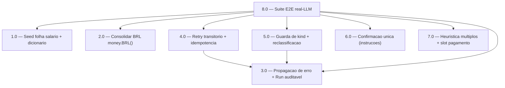

<!-- spec-hash-prd: aa6ebc2e1f1661f7f154591370b83cd2ce3ebbc59ca2dfa0f24a4501850bc69e -->
<!-- spec-hash-techspec: a2e9e7d6eca2d35a86b058d7ed427048a2273fe290a79e4e5fa99da1e544f13f -->
# Resumo das Tarefas de Implementação para Registro Conversacional Robusto

## Metadados
- **PRD:** `.specs/prd-registro-conversacional-robustez/prd.md`
- **Especificação Técnica:** `.specs/prd-registro-conversacional-robustez/techspec.md`
- **Total de tarefas:** 8
- **Tarefas paralelizáveis:** 1.0 com 6.0
- **Trio Go obrigatório (CLAUDE.md/AGENTS.md):** `go-implementation` é auto-carregada por detecção de
  diff no `execute-task` Stage 2 (não listada na coluna Skills por regra do template); `mastra`,
  `domain-modeling-production` e `design-patterns-mandatory` são declaradas em toda tarefa Go.

## Tarefas

<!-- Colunas e formato canônico (MANDATÓRIO):
     - `#`: id decimal `X.Y` (sempre X.0 para tarefas de topo).
     - `Status`: ^(pending|in_progress|needs_input|blocked|failed|done)$
     - `Dependências`: ^(—|\d+\.\d+(,\s*\d+\.\d+)*)$  (em-dash unicode quando vazio)
     - `Paralelizável`: ^(—|Não|Com\s+\d+\.\d+(,\s*\d+\.\d+)*)$
     - `Skills`: skills processuais extras (descoberta agnóstica em `.agents/skills/`). Use `—` quando
       não houver. Nunca listar skills auto-carregadas (governance/linguagem) nem `*-implementation`.
     - `Fase` (OPCIONAL): inteiro positivo para agrupamento visual de fases de entrega. Pode ser
       omitida em PRDs pequenos; `execute-all-tasks` não consome esta coluna. Se incluída, mantenha
       em todas as linhas para não quebrar o parser de tabela markdown. -->

| # | Título | Status | Dependências | Paralelizável | Skills |
|---|--------|--------|-------------|---------------|--------|
| 1.0 | Seed folha income `Salário > Salário` + dicionário | done | — | Com 6.0 | postgresql-production-standards, domain-modeling-production, design-patterns-mandatory, mastra |
| 2.0 | Consolidar formatação BRL canônica em `money.BRL()` | done | — | Não | mastra, domain-modeling-production, design-patterns-mandatory |
| 3.0 | Propagação de erro: fim do swallow + Run auditável no resume | done | — | Não | mastra, domain-modeling-production, design-patterns-mandatory |
| 4.0 | Retry transitório limitado + `IsTransient` + idempotência | done | 3.0 | Não | mastra, domain-modeling-production, design-patterns-mandatory |
| 5.0 | Guarda de kind + reclassificação + clarify único | done | 3.0 | Não | mastra, domain-modeling-production, design-patterns-mandatory |
| 6.0 | Confirmação única: reescrita de instruções do agente | done | — | Com 1.0 | mastra, domain-modeling-production, design-patterns-mandatory |
| 7.0 | Heurística múltiplos lançamentos + slot de forma de pagamento | done | — | Não | mastra, domain-modeling-production, design-patterns-mandatory |
| 8.0 | Suíte E2E real-LLM + integração dos cenários Gherkin | done | 1.0, 2.0, 3.0, 4.0, 5.0, 6.0, 7.0 | Não | mastra, domain-modeling-production, design-patterns-mandatory |

## Dependências Críticas
- **3.0 é fundação de observabilidade**: sem parar de engolir o erro, 4.0 (retry) não consegue
  distinguir falha para retentar, e 5.0 (guarda de kind) voltaria a cancelar em silêncio. Por isso
  4.0 e 5.0 dependem de 3.0.
- **8.0 depende de todas**: a suíte E2E real-LLM valida os cenários Gherkin ponta a ponta e só é
  significativa com 1.0–7.0 integradas.

## Riscos de Integração
- **Conflito de arquivo em `pending_entry_workflow.go`**: tocado por 2.0, 3.0, 4.0 e 5.0. Marcados
  `Não` (sequenciais) para evitar edição concorrente; 4.0/5.0 ainda dependem de 3.0.
- **Conflito de arquivo em `mecontrola_agent.go`**: tocado por 6.0 e 7.0. Marcados de forma a não
  paralelizar entre si (6.0 paraleliza apenas com 1.0, que é disjunto — migração).
- **Editorial version bump (1.0)**: pending entries suspensos antes do deploy podem sofrer
  `ErrVersionDrift` no resume (janela de deploy; comportamento é reclassificar, não corromper).
- **Aderência do LLM (6.0/7.0)**: instruções dependem do modelo; mitigado pela suíte real-LLM (8.0).

## Cobertura de Requisitos

| Tarefa | Requisitos cobertos |
|--------|-------------------|
| 1.0 | RF-01, RF-02, RF-03, RF-04, RF-05 |
| 2.0 | RF-26, RF-27, RF-28 |
| 3.0 | RF-10, RF-11, RF-12, RF-13 |
| 4.0 | RF-22, RF-23, RF-24, RF-25 |
| 5.0 | RF-06, RF-07, RF-08, RF-09 |
| 6.0 | RF-14, RF-15, RF-16, RF-17, RF-18 |
| 7.0 | RF-19, RF-20, RF-21, RF-29, RF-30, RF-31, RF-32 |
| 8.0 | RF-01, RF-02, RF-03, RF-04, RF-05, RF-06, RF-07, RF-08, RF-09, RF-10, RF-11, RF-12, RF-13, RF-14, RF-15, RF-16, RF-17, RF-18, RF-19, RF-20, RF-21, RF-22, RF-23, RF-24, RF-25, RF-26, RF-27, RF-28, RF-29, RF-30, RF-31, RF-32 |

## Grafo de Dependencias

## Legenda de Status
- `pending`: aguardando execução
- `in_progress`: em execução
- `needs_input`: aguardando informação do usuário
- `blocked`: bloqueado por dependência ou falha externa
- `failed`: falhou após limite de remediação
- `done`: completado e aprovado
