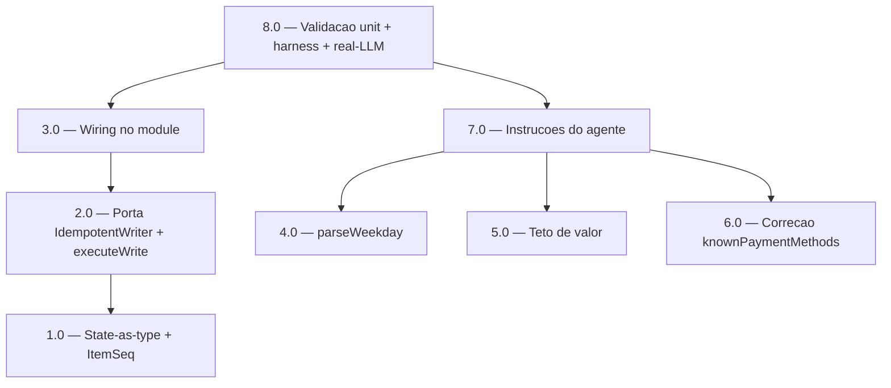

<!-- spec-hash-prd: cc934387c2bb366933c786ce190002c5e4aa2764a77a8c68b7251f02044d9242 -->
<!-- spec-hash-techspec: ebea3a18cbd89c11e3ce83819bd459130b986c1c2eee96ecb97090c4bc659f39 -->
# Resumo das Tarefas de Implementação para Registro Conversacional de Transações do Dia a Dia

## Metadados
- **PRD:** `.specs/prd-registro-conversacional-transacoes-dia-a-dia/prd.md`
- **Especificação Técnica:** `.specs/prd-registro-conversacional-transacoes-dia-a-dia/techspec.md`
- **Total de tarefas:** 8
- **Tarefas paralelizáveis:** 4.0, 5.0, 6.0

## Tarefas

| # | Título | Status | Dependências | Paralelizável | Skills |
|---|--------|--------|-------------|---------------|--------|
| 1.0 | State-as-type `PendingOperationKind` + campo `ItemSeq` no `PendingEntryState` | done | — | — | mastra |
| 2.0 | Porta `IdempotentWriter` + integração de idempotência em `executeWrite` | done | 1.0 | Não | mastra |
| 3.0 | Wiring de produção da idempotência no `module` | done | 2.0 | Não | mastra |
| 4.0 | Parser de dias da semana `parseWeekday` + encaixe em `parseInputDate` | done | — | Com 5.0, 6.0 | mastra |
| 5.0 | Guarda de teto de valor `validateEntryAmount` nos execs de registro | done | — | Com 4.0, 6.0 | mastra |
| 6.0 | Correção de `knownPaymentMethods` + gate `map × ParsePaymentMethod` | done | — | Com 4.0, 5.0 | mastra |
| 7.0 | Endurecimento das instruções do agente `mecontrola` | done | 4.0, 5.0, 6.0 | Não | mastra |
| 8.0 | Validação: testes unit + harness + real-LLM (M-04 ≥ 0,90) | done | 3.0, 7.0 | Não | mastra |

## Dependências Críticas
- Trilha de idempotência estritamente sequencial: **1.0 → 2.0 → 3.0**. A porta `IdempotentWriter` (2.0) depende do campo `ItemSeq` e do `String()` do `PendingOperationKind` (1.0); o wiring no `module` (3.0) depende da assinatura nova de `BuildPendingEntryWorkflow` (2.0).
- **7.0** depende de 4.0/5.0/6.0 para que as instruções descrevam comportamento já implementado (evita drift entre prompt e código).
- **8.0** é a fatia de validação final; depende de 3.0 (idempotência plugada) e 7.0 (instruções finais) e verifica todos os RFs de comportamento, incluindo M-04 real-LLM.

## Riscos de Integração
- **Assinatura de `BuildPendingEntryWorkflow`** muda em 2.0 e afeta dois call sites: `module.go` (3.0) e `newPEHarness` no harness de teste (2.0/8.0). Ambos devem passar a porta; harness usa fake in-memory.
- **Ciclo de import** `workflows ↔ usecases`: a porta em 2.0 deve retornar apenas primitivos + `agent.ToolOutcome` (ver ADR-001). Introduzir tipo de `usecases` na interface reintroduz o ciclo.
- **Duas camadas de idempotência** (mensagem via `ProcessedMessageID` já existente vs. write-ledger durável nova): 8.0 deve testar as duas separadamente para não confundir cobertura.
- **`knownPaymentMethods` fora de escopo** (`ted`/`doc`/`transferencia`): 6.0 corrige apenas métodos in-scope da PRD; entradas fora de escopo permanecem como risco conhecido documentado, não silenciadas.

## Cobertura de Requisitos

| Tarefa | Requisitos cobertos |
|--------|-------------------|
| 1.0 | RF-19, RF-20 |
| 2.0 | RF-19, RF-20 |
| 3.0 | RF-19, RF-20 |
| 4.0 | RF-06, RF-07, RF-08, RF-10 |
| 5.0 | RF-04, RF-05 |
| 6.0 | RF-01, RF-02 |
| 7.0 | RF-01, RF-02, RF-03, RF-09, RF-11, RF-12, RF-13, RF-14, RF-15, RF-16, RF-17, RF-18, RF-21, RF-22, RF-23 |
| 8.0 | RF-01, RF-02, RF-03, RF-04, RF-05, RF-06, RF-07, RF-08, RF-09, RF-10, RF-11, RF-12, RF-13, RF-14, RF-15, RF-16, RF-17, RF-18, RF-19, RF-20, RF-21, RF-22, RF-23 |

## Grafo de Dependencias

## Legenda de Status
- `pending`: aguardando execução
- `in_progress`: em execução
- `needs_input`: aguardando informação do usuário
- `blocked`: bloqueado por dependência ou falha externa
- `failed`: falhou após limite de remediação
- `done`: completado e aprovado
