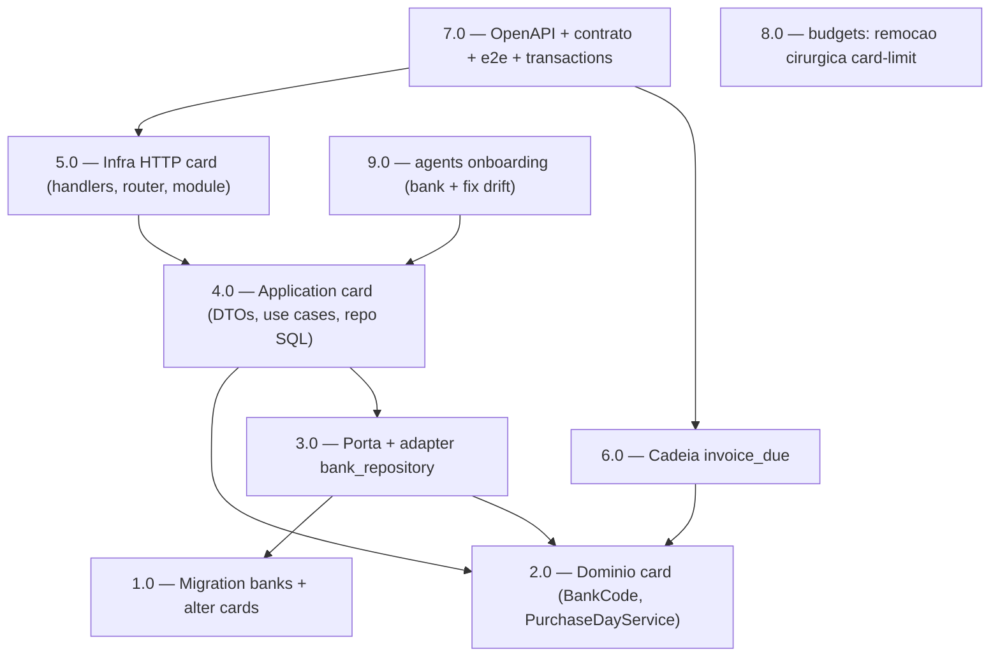

<!-- spec-hash-prd: 5384373f31eb476dea92e45e83a8872200c7a32d552818507909436676973663 -->
<!-- spec-hash-techspec: 2185b3ec9320db97cce02658cb252934bb166450b7a3de303c9dc6419ad96efc -->
# Resumo das Tarefas de Implementação para Simplificação do CRUD de `internal/card` e "Melhor Dia de Compra"

## Metadados
- **PRD:** `.specs/prd-simplificacao-card-melhor-dia-compra/prd.md`
- **Especificação Técnica:** `.specs/prd-simplificacao-card-melhor-dia-compra/techspec.md`
- **Total de tarefas:** 9
- **Tarefas paralelizáveis:** 1.0↔2.0↔8.0, 5.0↔6.0, 6.0↔9.0

> **go-implementation obrigatória:** todas as tarefas tocam Go/SQL; a skill de linguagem `go-implementation`
> é auto-carregada por detecção de diff em `execute-task` Stage 2 e é mandatória por `CLAUDE.md` (Etapas 1-5,
> R0-R7). Por isso não aparece na coluna `Skills` (reservada a skills processuais extras), mas vale para 1.0-9.0.

## Tarefas

<!-- Colunas e formato canônico (MANDATÓRIO) — ver template. -->

| # | Título | Status | Dependências | Paralelizável | Skills |
|---|--------|--------|-------------|---------------|--------|
| 1.0 | Migration `000002`: tabela `banks` + seed; altera `cards` (drop `limit_cents`+`name`, add `bank`) | done | — | Com 2.0 | — |
| 2.0 | Domínio card: VO `BankCode`, `PurchaseDayService` puro, entity/deciders/errors | done | — | Com 1.0 | — |
| 3.0 | Porta `BankDaysReader` + adapter `bank_repository` (fallback 7) + wiring factory | done | 1.0, 2.0 | — | — |
| 4.0 | Application card: DTOs, use cases (`CreateCard`/`UpdateCard` recompute, `BestPurchaseDay`; remove `UpdateCardLimit`), mapper, repo SQL | done | 2.0, 3.0 | — | — |
| 5.0 | Infra HTTP card: handlers, router (rota nova antes de `{id}`, remove `/limit`), module wiring | done | 4.0 | Com 6.0 | — |
| 6.0 | Cadeia `invoice_due`: decider/evaluate/producer/consumer/notify (drop `LimitCents`, `card_name`→`card_nickname`) | done | 2.0 | Com 5.0 | — |
| 7.0 | OpenAPI + testes de contrato + e2e; verificação de não-regressão de `internal/transactions` | done | 5.0, 6.0 | — | — |
| 8.0 | budgets: remoção cirúrgica do alerta de limite de cartão (ADR-004) + auditoria dashboard/alerta | done | — | Com 1.0 | otel-grafana-dashboards |
| 9.0 | agents onboarding: coletar `bank`, corrigir drift `ClosingDay=DueDay`, remover `LimitCents` | done | 4.0 | Com 6.0 | mastra |

## Dependências Críticas
- **1.0 (migration)** habilita 3.0 (lookup em `banks`) e o novo schema de `cards` consumido por 4.0.
- **2.0 (domínio)** é base de 3.0, 4.0 e 6.0 (entity sem `Name`/`LimitCents`, VO `BankCode`, `PurchaseDayService`).
- **3.0 → 4.0**: use cases dependem da porta `BankDaysReader` para resolver dias + fallback.
- **4.0 → 5.0/9.0**: handlers e o adapter de onboarding dependem da nova assinatura de `input.CreateCard`/`UpdateCard` e dos use cases.
- **5.0 + 6.0 → 7.0**: contrato OpenAPI/e2e só fecha após HTTP e a cadeia de evento estarem no novo formato.

## Riscos de Integração
- **Migration vs budgets (ordem de deploy):** 1.0 dropa `cards.limit_cents`; enquanto 8.0 não remover a leitura em `internal/budgets` (`card_threshold_reader`), uma query a `c.limit_cents` falharia em runtime. **Mitigação:** 8.0 e 1.0 devem **entrar juntas** no mesmo deploy; ambas são paralelizáveis mas nenhuma pode ir a produção sozinha. Sem cartões/uso em produção reduz o risco, mas a co-entrega é obrigatória.
- **Ordering de rota chi (5.0):** `GET /cards/best-purchase-day` deve ser registrado **antes** de `Route("/{id}")`, senão é capturado como `{id}`. Gate em `router_test.go`.
- **Renomeação `card_name`→`card_nickname` (6.0):** producer, consumer e `NotifyInvoiceDueInput` devem mudar juntos (mesmo PR) para o evento `card.invoice_due.v1` não quebrar entre publish e consume.
- **RF-14 (transactions):** nenhuma alteração esperada; 7.0 prova por suíte verde de transactions **sem diff**. Qualquer diff em `internal/transactions` é sinal de regressão de contrato.
- **Cache de `closing_day` (ADR-002):** derivado e persistido no cadastro/edição; mudança posterior de `banks.days_before_due` não retroalimenta cartões (reconciliação em massa fora de escopo).
- **> 10 tarefas:** não aplicável (9 tarefas).

## Cobertura de Requisitos

| Tarefa | Requisitos cobertos |
|--------|-------------------|
| 1.0 | RF-10, RF-17 |
| 2.0 | RF-02, RF-03, RF-06, RF-08, RF-11, RF-20 |
| 3.0 | RF-09, RF-10 |
| 4.0 | RF-01, RF-04, RF-05, RF-07, RF-12, RF-13 |
| 5.0 | RF-01, RF-05, RF-13, RF-18 |
| 6.0 | RF-05, RF-19 |
| 7.0 | RF-14, RF-18 |
| 8.0 | RF-15 |
| 9.0 | RF-16 |

## Grafo de Dependencias

## Legenda de Status
- `pending`: aguardando execução
- `in_progress`: em execução
- `needs_input`: aguardando informação do usuário
- `blocked`: bloqueado por dependência ou falha externa
- `failed`: falhou após limite de remediação
- `done`: completado e aprovado
