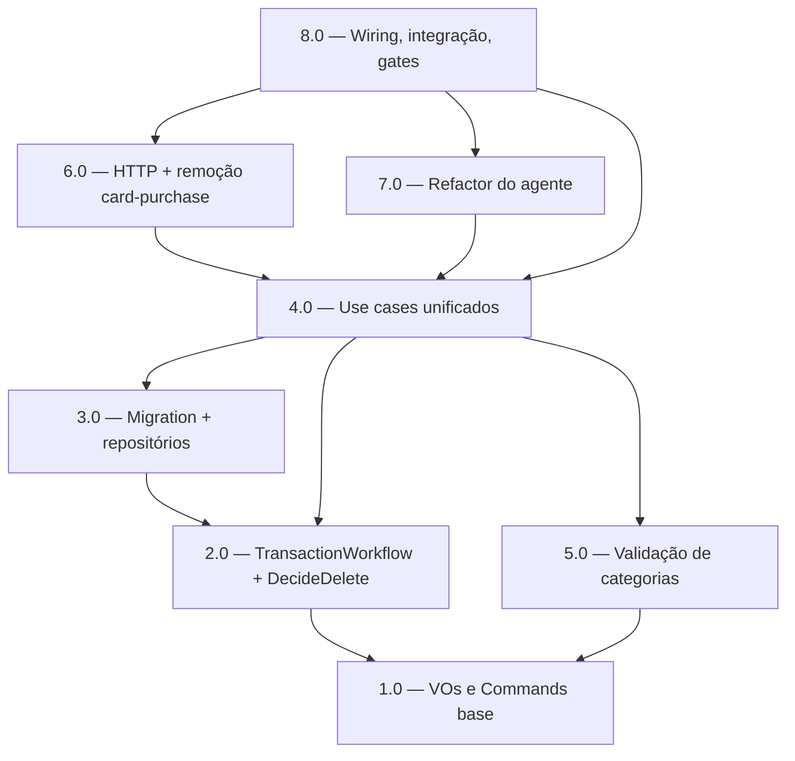

<!-- spec-hash-prd: 4a96b713bde8f8d820a85a3ba0c262be8b6f27ab92219483baff2089ed98f18d -->
<!-- spec-hash-techspec: ff7547e7b4bc4fc1e27bce8f4258928209dd1e62c0bb6dc888153882e4bb2120 -->
# Resumo das Tarefas de Implementação para CRUD Unificado de Transações

## Metadados
- **PRD:** `.specs/prd-transactions-crud-unificado/prd.md`
- **Especificação Técnica:** `.specs/prd-transactions-crud-unificado/techspec.md`
- **Total de tarefas:** 8
- **Tarefas paralelizáveis:** 2.0 ‖ 5.0, 6.0 ‖ 7.0

## Tarefas

| # | Título | Status | Dependências | Paralelizável | Skills |
|---|--------|--------|-------------|---------------|--------|
| 1.0 | VOs e Commands base (PaymentMethod VR/VA, sentinels credit_card) | done | — | — | 1.0_execution_report.md |
| 2.0 | TransactionWorkflow enriquecido + DecideDelete + entity/eventos | done | 1.0 | Com 5.0 | — |
| 3.0 | Migration 000003 + repositórios unificados | done | 2.0 | Não | 3.0_execution_report.md |
| 4.0 | Use cases unificados create/update/delete | done | 2.0, 3.0, 5.0 | Não | 4.0_execution_report.md |
| 5.0 | Validação de categorias (raiz, filha direta, kind↔direction) | done | 1.0 | Com 2.0 | 5.0_execution_report.md |
| 6.0 | HTTP unificado + remoção de card-purchase + OpenAPI | done | 4.0 | Com 7.0 | 6.0_execution_report.md |
| 7.0 | Refactor do agente para CRUD unificado | done | 4.0 | Com 6.0 | 7.0_execution_report.md |
| 8.0 | Wiring, integração/e2e, observabilidade e gates | done | 4.0, 6.0, 7.0 | Não | 8.0_execution_report.md |

## Dependências Críticas
- Caminho crítico: 1.0 → 2.0 → 3.0 → 4.0 → (6.0 ‖ 7.0) → 8.0.
- 5.0 (categorias) depende só de 1.0 e paraleliza com 2.0; 4.0 consome 5.0.
- 3.0 depende de 2.0 (colunas de cartão da entidade `Transaction` são persistidas/lidas pelos repos).
- 8.0 fecha wiring + integração + gates e depende de 4.0, 6.0 e 7.0.

## Riscos de Integração
- **Double-counting no resumo mensal**: 3.0 (SumByMonthExcludingCredit/ListEntries filtrado) e 4.0
  (fonte única) precisam estar sincronizadas — teste de integração dedicado em 8.0.
- **Corte de card-purchase (breaking, RF-24/24a)**: 6.0 (rotas/handlers) e 7.0 (agente) devem entrar
  juntas; gate pré-release count=0 antes do drop (8.0). Ver ADR-002.
- **OCC de fatura em N meses**: 4.0 mantém tudo no mesmo UoW; conflito → rollback total + 409.
- **Escopo > 8 tarefas evitado**: fatias coerentes por camada; correções de bug pré-existentes
  embutidas nas tarefas que tocam o mesmo código (não viram tarefas isoladas).

## Cobertura de Requisitos

| Tarefa | Requisitos cobertos |
|--------|-------------------|
| 1.0 | RF-03, RF-05, RF-06, RF-07, RF-08, RF-09, RF-11a, RF-11b, RF-13, RF-14 |
| 2.0 | RF-10, RF-11, RF-12, RF-15, RF-16, RF-16a |
| 3.0 | RF-12, RF-16, RF-16a, RF-24a |
| 4.0 | RF-01, RF-02, RF-04, RF-10, RF-11, RF-12, RF-16, RF-16a |
| 5.0 | RF-17, RF-18, RF-19, RF-20, RF-21 |
| 6.0 | RF-03, RF-05, RF-07, RF-11a, RF-11b, RF-13, RF-14, RF-19, RF-24 |
| 7.0 | RF-11a, RF-11b, RF-24 |
| 8.0 | RF-01, RF-22, RF-23, RF-24, RF-24a |

## Grafo de Dependencias

## Legenda de Status
- `pending`: aguardando execução
- `in_progress`: em execução
- `needs_input`: aguardando informação do usuário
- `blocked`: bloqueado por dependência ou falha externa
- `failed`: falhou após limite de remediação
- `done`: completado e aprovado
