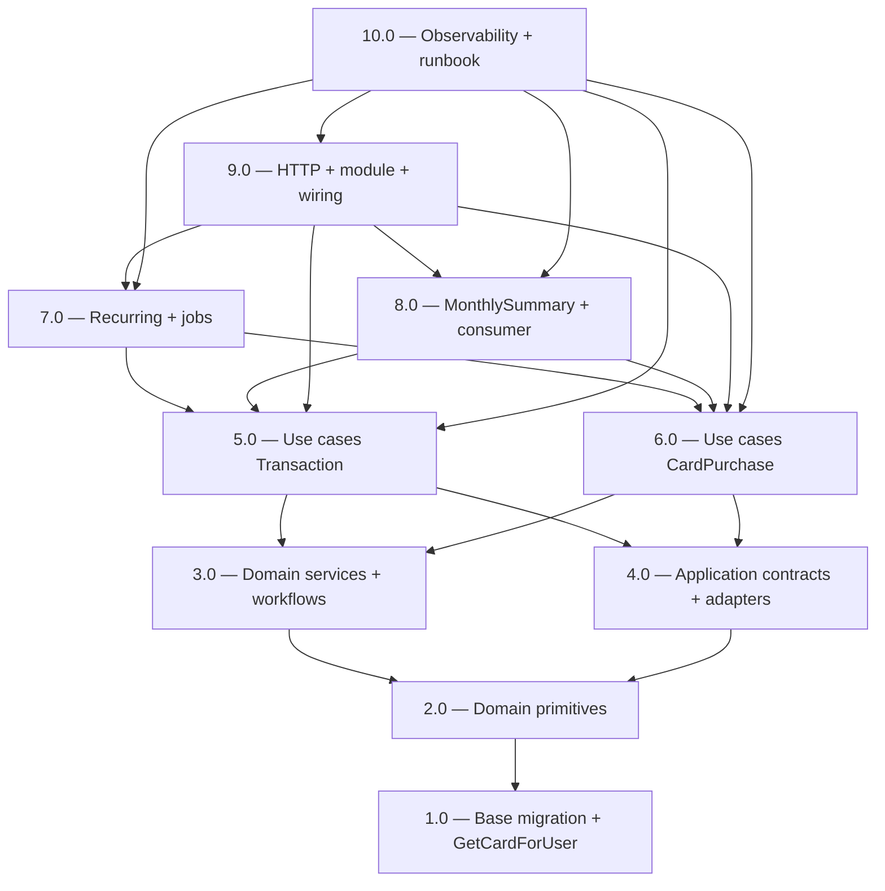

<!-- spec-hash-prd: 906baec8051ad3dfa9cd13ce11248fd2621761bebcfaf769937640dc14810170 -->
<!-- spec-hash-techspec: 72b527ad520a5bc6800fb1def5a65bb706727c9f087b8d53e567b12c0272c70d -->
# Resumo das Tarefas de Implementação para `internal/transactions`

## Metadados
- **PRD:** `.specs/prd-transactions-monthly/prd.md`
- **Especificação Técnica:** `.specs/prd-transactions-monthly/techspec.md`
- **Total de tarefas:** 10
- **Tarefas paralelizáveis:** 5.0↔6.0 e 7.0↔8.0

## Tarefas

| # | Título | Status | Dependências | Paralelizável | Skills |
|---|--------|--------|-------------|---------------|--------|
| 1.0 | Base — migration 000014 + cross-module GetCardForUser | pending | — | — | — |
| 2.0 | Domain primitives — VOs, option, commands, entities, events | pending | 1.0 | — | — |
| 3.0 | Domain services — splitter, cycle resolver (clamp), workflows Decide* | pending | 2.0 | — | — |
| 4.0 | Application contracts — interfaces, DTOs, CategoriesCache, CardLookup adapter | pending | 2.0 | — | — |
| 5.0 | Use cases Transaction + repo + producer + integration tests | pending | 3.0, 4.0 | Com 6.0 | — |
| 6.0 | Use cases CardPurchase + repos + producer + cascade com ApplyDelta | pending | 3.0, 4.0 | Com 5.0 | — |
| 7.0 | Use cases Recurring + Materializer job double-layer + Reconciler job | pending | 5.0, 6.0 | Com 8.0 | — |
| 8.0 | MonthlySummary projection + consumer com coalescing 1500ms | pending | 5.0, 6.0 | Com 7.0 | — |
| 9.0 | HTTP layer + module.go + wiring cmd/api e cmd/worker + feature flag | pending | 5.0, 6.0, 7.0, 8.0 | Não | — |
| 10.0 | Observability — dashboard Grafana + alertas + runbook + governance rule | pending | 5.0, 6.0, 7.0, 8.0, 9.0 | Não | otel-grafana-dashboards |

## Dependências Críticas
- **1.0** desbloqueia tudo: schema base (`000014`) + `internal/card.GetCardForUser` consumido por adapter outbound de `transactions`.
- **2.0 → 3.0**: workflows `Decide*` consomem VOs, commands e domain events.
- **5.0 e 6.0 paralelizáveis** entre si (módulos disjuntos: `Transaction` vs `CardPurchase`).
- **7.0 e 8.0 paralelizáveis** entre si após 5.0/6.0: jobs (recurring/reconciler) e consumer (recompute) são adapters distintos.
- **9.0** depende de todo o ciclo de use cases prontos: handlers HTTP + módulo + wiring nos dois binários (`cmd/api` registra apenas router, `cmd/worker` apenas consumer + 2 jobs).
- **10.0** consome estado pronto para instrumentar e documentar (dashboard, runbook, regra de governance).

## Riscos de Integração
- **Cascade em PATCH de CardPurchase** (Task 6.0) toca múltiplas faturas via `ApplyDelta` com optimistic locking; risco de 409 em concorrência. Integration test obrigatório com 24 parcelas, delta negativo, clamp de fevereiro.
- **Coalescer do consumer** (Task 8.0) usa `time.Timer` + mutex; lifecycle precisa drenar timers pendentes no shutdown (`graceful-lifecycle.md`). Integration test cobrindo `Stop()` durante pendência.
- **Materializer diário** (Task 7.0) tem janela de spike quando `day_of_month` é popular (dia 5 salário, dia 10 aluguel); batch de 200 templates + cron configurável fora do horário comercial.
- **Feature flag rollback** (Task 9.0) tem semântica "stop new writes + drain outbox", não "stop world"; documentar nos handlers.
- **Cross-module `internal/card`** (Task 1.0) exige PR coordenado; `GetCardForUser` é fino e backward-compatible.

## Cobertura de Requisitos

| Tarefa | Requisitos cobertos |
|--------|-------------------|
| 1.0 | RT-02, RT-19, AS-01, base schema p/ RF-01..RF-47, novo use case em `internal/card` (suporta RF-12, RF-13) |
| 2.0 | RF-02, RF-03, RF-04, RF-29 (campos/enums), parte estrutural de RF-35..RF-37 (domain events), ADR-006 §1/§3/§4 |
| 3.0 | RF-03, RF-14, RF-15, RF-16, RF-25, RF-26, RF-31, RF-32, RF-33, RF-36, ADR-006 §2, audit fixes #3/#4 |
| 4.0 | RF-04, RF-12, RF-13, RF-22, RT-22, ADR-006 §1 (commands package consumido) |
| 5.0 | RF-01, RF-02, RF-05, RF-06, RF-07, RF-08, RF-09, RF-10, RF-35, RF-38, RF-41, RF-42, RF-43, RF-44, RF-45 |
| 6.0 | RF-11, RF-12, RF-13, RF-14, RF-15, RF-16, RF-17, RF-18, RF-19, RF-20, RF-21, RF-22, RF-36 |
| 7.0 | RF-27, RF-29, RF-30, RF-31, RF-32, RF-33, RF-34, RF-37, RF-38, RF-40 |
| 8.0 | RF-23, RF-24, RF-25, RF-26, RF-27, RF-28, RF-39, RF-40 |
| 9.0 | RF-09, RF-10, RF-22, RF-30, RF-41, RF-44, RF-45, RF-46, RF-47, RT-07, RT-17 |
| 10.0 | RT-13, RT-14, RT-15, AS-12, ADR-006 gate de revisão |

## Grafo de Dependencias

## Legenda de Status
- `pending`: aguardando execução
- `in_progress`: em execução
- `needs_input`: aguardando informação do usuário
- `blocked`: bloqueado por dependência ou falha externa
- `failed`: falhou após limite de remediação
- `done`: completado e aprovado
