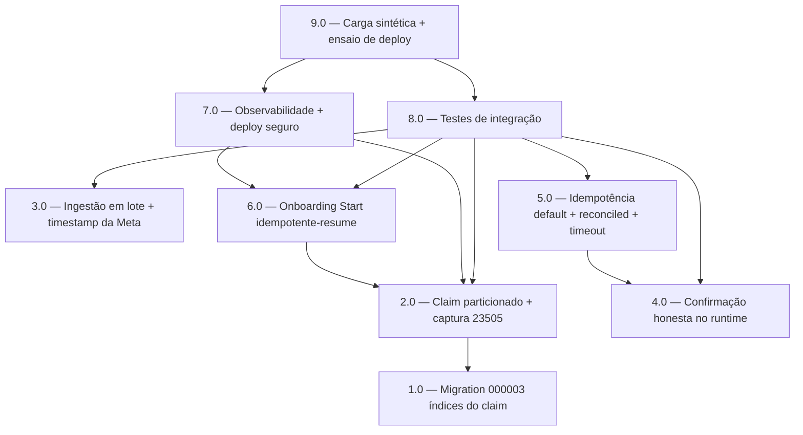

<!-- spec-hash-prd: 2d499fa172faacaf6a9f7d94abdf5b1304ff2f672758b24b0817e1ad4f99e099 -->
<!-- spec-hash-techspec: dadf37f9f5aa3edca516c78d8cc5f60330b1723e743f74d21d183234b4710a6f -->
# Resumo das Tarefas de Implementação para Ordenação e Idempotência do Fluxo WhatsApp do Agente

## Metadados
- **PRD:** `.specs/prd-whatsapp-ordenacao-idempotencia/prd.md` (v3, RF-01..23)
- **Especificação Técnica:** `.specs/prd-whatsapp-ordenacao-idempotencia/techspec.md`
- **ADRs:** ADR-001 (claim particionado), ADR-002 (confirmação honesta + idempotência), ADR-003 (onboarding start-resume), ADR-004 (observabilidade + deploy), ADR-005 (ingestão em lote)
- **Total de tarefas:** 9
- **Tarefas paralelizáveis:** 2.0/3.0/4.0 (entre si, após 1.0); 5.0/6.0 (entre si)

## Tarefas

<!-- Colunas e formato canônico (MANDATÓRIO):
     - `#`: id decimal `X.Y` (sempre X.0 para tarefas de topo).
     - `Status`: ^(pending|in_progress|needs_input|blocked|failed|done)$
     - `Dependências`: ^(—|\d+\.\d+(,\s*\d+\.\d+)*)$  (em-dash unicode quando vazio)
     - `Paralelizável`: ^(—|Não|Com\s+\d+\.\d+(,\s*\d+\.\d+)*)$
     - `Skills`: skills processuais extras (descoberta agnóstica em `.agents/skills/`). Use `—` quando
       não houver. Nunca listar skills auto-carregadas (governance/linguagem) nem `*-implementation`. -->

| # | Título | Status | Dependências | Paralelizável | Skills |
|---|--------|--------|-------------|---------------|--------|
| 1.0 | Migration 000003: índices parciais do claim particionado | done | — | — | — |
| 2.0 | Claim particionado no ClaimBatch + captura de SQLSTATE 23505 | done | 1.0 | Com 3.0, 4.0 | — |
| 3.0 | Ingestão em lote do webhook + timestamp da Meta no OccurredAt | done | — | Com 2.0, 4.0 | mastra |
| 4.0 | Confirmação honesta no runtime do agente (fim do sucesso alucinado e envio vazio) | done | — | Com 2.0, 3.0 | mastra |
| 5.0 | Idempotência default + mapa reconciled + timeout de coerência + remoção do advisory lock | done | 4.0 | Com 6.0 | mastra |
| 6.0 | Onboarding Start idempotente-resume + persistência de turnos | done | 2.0 | Com 5.0 | mastra |
| 7.0 | Observabilidade do caminho crítico + deploy seguro + dead-letter | done | 2.0, 6.0 | — | otel-grafana-dashboards |
| 8.0 | Testes de integração (testcontainers): concorrência, idempotência, onboarding, poison | done | 2.0, 3.0, 4.0, 5.0, 6.0 | — | mastra |
| 9.0 | Gate de carga sintética por fase + ensaio de rolling deploy | done | 7.0, 8.0 | — | otel-grafana-dashboards |

## Dependências Críticas
- 1.0 → 2.0: o `ClaimBatch` particionado depende dos índices parciais (`outbox_events_user_pending_occurred_idx` e o backstop único `outbox_events_user_inflight_uidx`) criados em 1.0. Pré-condição: a tabela nasce com 0 linhas `status=2`, o índice único parcial é seguro (verificar com `SELECT count(*) FROM mecontrola.outbox_events WHERE status=2` antes de aplicar).
- 2.0 → 6.0: a atomicidade da resolução onboarding-vs-agente (fim do TOCTOU, RF-10) só é garantida sob o claim particionado (1 evento em voo por usuário).
- 4.0 → 5.0: o mapa `reconciled`/replay e a remoção do gate de idempotência dependem das write tools já propagando `ToolOutcome` tipado (4.0).
- 6.0 → 7.0: o outcome `resumed_on_conflict` observado em 7.0 nasce do Start idempotente-resume implementado em 6.0.
- 2.0/3.0/4.0/5.0/6.0 → 8.0: os testes de integração exigem claim, ingestão em lote, confirmação honesta (4.0 — CA-03), idempotência (5.0) e onboarding-resume prontos.
- 7.0/8.0 → 9.0: o gate de carga sintética e o ensaio de deploy exigem observabilidade (lag/dedup/traces) e a suíte de integração verdes.

## Riscos de Integração
- `go-implementation` e `object-calisthenics-go` são `category: language` e NÃO aparecem na coluna Skills — `execute-task` Stage 2 as auto-carrega por detecção de diff Go. O mandato de CLAUDE.md (go-implementation obrigatória em toda tarefa Go, Etapas 1..5, checklist R0..R7) é honrado em execução, não por declaração aqui.
- **Falso-positivo já removido (D-17/RF-20):** a idempotência de escrita de domínio JÁ EXISTE em produção (`transactions_origin_uk`, `transactions_card_purchases_origin_uk`, `origin` cabeado ponta-a-ponta, usecase retorna `Reconciled`). Nenhuma tarefa cria migration de chave natural nova; a tarefa 5.0 apenas **preserva** e mapeia o conflito para `ToolOutcomeReconciled`/replay, mais o gate de revisão para novas tools.
- **Índice único parcial em voo (RF-01/D-14):** a colisão worker-1/2 no `outbox_events_user_inflight_uidx` aborta o `UPDATE ... FROM claimable` inteiro com `SQLSTATE 23505`; 2.0 DEVE capturar o 23505 e **adiar** o lote (não fatal). Regressão silenciosa se tratado como erro comum.
- **Convergência em `engine.go`:** 6.0 (Start resume) e 7.0 (métrica `resumed_on_conflict`) tocam `internal/platform/workflow/engine.go`; 7.0 depende de 6.0 para evitar conflito de merge.
- **R-WF-KERNEL-001 no kernel:** a captura de `unique_violation → ErrRunAlreadyExists → resume` (6.0) e o SQL do claim (2.0) DEVEM permanecer genéricos, sem domínio; SQL só no adapter Postgres.
- **LLM real obrigatório (4.0/8.0):** a mudança de confirmação honesta exige validação com LLM real (`RUN_REAL_LLM=1` + credenciais `OPENROUTER_*` do `.env`); mocks não bastam como evidência (memória `feedback_realllm_validation_required`).
- **Produção = 1 usuário, sem baseline:** a escala 10k e os SLOs de D-05 só são verificáveis por carga sintética (9.0); não há observação de baseline de produção.

> Justificativa de contagem (>0 tarefas de plataforma sensível): 9 tarefas mantêm cada fatia coerente
> (migration; claim; ingestão; confirmação; idempotência; onboarding; observabilidade/deploy;
> integração; carga/deploy), respeitando o teto de 10 e a orquestração por área de
> `feedback_subagents_orchestration`.

## Cobertura de Requisitos

| Tarefa | Requisitos cobertos |
|--------|-------------------|
| 1.0 | RF-01 |
| 2.0 | RF-01, RF-02, RF-03 |
| 3.0 | RF-17, RF-18 |
| 4.0 | RF-06, RF-07, RF-08 |
| 5.0 | RF-04, RF-05, RF-20, RF-21 |
| 6.0 | RF-09, RF-10, RF-11, RF-12 |
| 7.0 | RF-13, RF-14, RF-15, RF-16, RF-22 |
| 8.0 | CA-01, CA-02, CA-03, CA-04, CA-07, CA-09, CA-10 |
| 9.0 | RF-19, RF-23, CA-05, CA-06, CA-08 |

## Matriz de Rastreabilidade RF/CA → Tarefa

| RF/CA | Tarefa(s) | ADR |
|-------|-----------|-----|
| RF-01 | 1.0, 2.0 | ADR-001 |
| RF-02 | 2.0 | ADR-001 |
| RF-03 | 2.0 | ADR-001 |
| RF-04 | 5.0 | ADR-002 |
| RF-05 | 5.0 | ADR-002 |
| RF-06 | 4.0 | ADR-002 |
| RF-07 | 4.0 | ADR-002 |
| RF-08 | 4.0 | ADR-002 |
| RF-09 | 6.0 | ADR-003 |
| RF-10 | 6.0 | ADR-003 |
| RF-11 | 6.0 | ADR-003 |
| RF-12 | 6.0 | ADR-003 |
| RF-13 | 7.0 | ADR-004 |
| RF-14 | 7.0 | ADR-004 |
| RF-15 | 7.0 | ADR-004 |
| RF-16 | 7.0 | ADR-004 |
| RF-17 | 3.0 | ADR-005 |
| RF-18 | 3.0 | ADR-005, ADR-001 |
| RF-19 | 9.0 | ADR-001 |
| RF-20 | 5.0 | ADR-002 |
| RF-21 | 5.0 | ADR-002 |
| RF-22 | 7.0 | ADR-001, ADR-004 |
| RF-23 | 9.0 | ADR-004 |
| CA-01 | 8.0, 9.0 | ADR-001 |
| CA-02 | 8.0 | ADR-002 |
| CA-03 | 8.0 | ADR-002 |
| CA-04 | 8.0 | ADR-003 |
| CA-05 | 9.0 | ADR-004 |
| CA-06 | 9.0 | ADR-004 |
| CA-07 | 8.0 | ADR-005 |
| CA-08 | 9.0 | ADR-001, ADR-004 |
| CA-09 | 8.0 | ADR-002 |
| CA-10 | 8.0 | ADR-001 |

## Grafo de Dependencias

## Legenda de Status
- `pending`: aguardando execução
- `in_progress`: em execução
- `needs_input`: aguardando informação do usuário
- `blocked`: bloqueado por dependência ou falha externa
- `failed`: falhou após limite de remediação
- `done`: completado e aprovado
