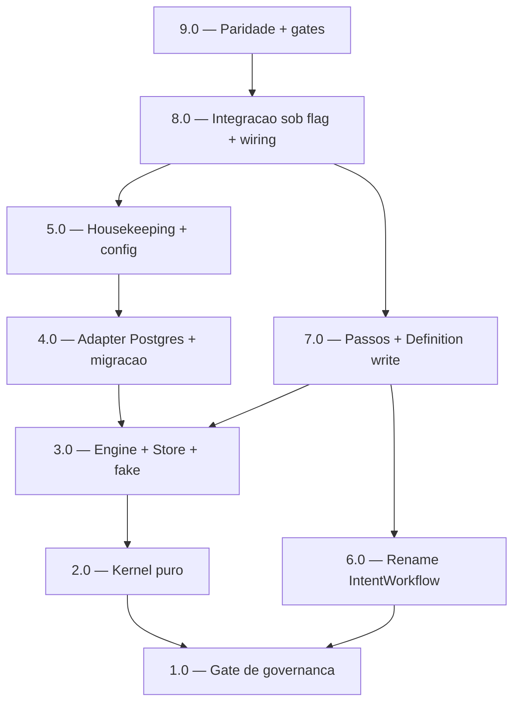

<!-- spec-hash-prd: 61bccc0e72f8f494c8210df6ddd040df9c6cd71878e4cb904d0d4ea9221146a9 -->
<!-- spec-hash-techspec: 81a2eb5e3d4e0113ac2ea7a3fe474562bb4c7acb9b7138810e0908f5389e5553 -->
# Resumo das Tarefas de Implementação para Workflow Kernel reutilizável

## Metadados
- **PRD:** `.specs/prd-workflow-kernel/prd.md`
- **Especificação Técnica:** `.specs/prd-workflow-kernel/techspec.md`
- **Total de tarefas:** 9
- **Tarefas paralelizáveis:** 2.0 ↔ 6.0

## Tarefas

| # | Título | Status | Dependências | Paralelizável | Skills |
|---|--------|--------|-------------|---------------|--------|
| 1.0 | Gate de governança (R-WF-KERNEL-001 + addendum R-AGENT-WF-001) | pending | — | — | — |
| 2.0 | Kernel puro: Step, combinadores e codec | pending | 1.0 | Com 6.0 | — |
| 3.0 | Engine + porta Store + fake (suspend/resume, retry, observabilidade) | pending | 2.0 | — | — |
| 4.0 | Adapter Postgres + migração 000019 (CAS + índice parcial) | pending | 3.0 | — | — |
| 5.0 | Housekeeping job + configuração de ambiente | pending | 4.0 | — | — |
| 6.0 | Rename Workflow → IntentWorkflow no agent | pending | 1.0 | Com 2.0 | mastra |
| 7.0 | Passos do agent + Definition transactions_write | pending | 3.0, 6.0 | — | mastra |
| 8.0 | Integração sob feature flag + wiring + resume-before-parse | pending | 5.0, 7.0 | — | mastra |
| 9.0 | Paridade/não regressão + validação de gates | pending | 8.0 | — | mastra |

## Dependências Críticas
- **1.0 é gate bloqueante (RF-29):** governança redigida antes de qualquer código do kernel; todas as demais dependem dela.
- **Caminho crítico do kernel:** 1.0 → 2.0 → 3.0 → 4.0 → 5.0 → 8.0 → 9.0.
- **3.0 é pré-requisito da prova:** a API do `Engine` precisa estar estável antes de 7.0.
- **8.0 depende de 5.0 e 7.0:** o corte sob flag exige config/flag (5.0) e os passos/Definition (7.0).
- **9.0 fecha a entrega:** paridade e gates só rodam após a integração completa (8.0).

## Riscos de Integração
- **Tarefa 8.0 (cutover sob flag + drenagem do draft legado):** maior risco de integração — corte do
  caminho atual para o kernel com fallback de leitura ao `agent_sessions.pending_action`. Mitigado por
  feature flag default off (ADR-005) e pela suíte de paridade (9.0).
- **Tarefa 7.0 (preservação 1:1 do WriteGuard e do resume):** divergência sutil de comportamento é o
  principal risco de regressão. Mitigado pela decomposição documentada na techspec e pela prova (9.0).
- **Tarefa 6.0 (rename amplo):** churn mecânico em `internal/agent`; isolado e sem mudança de
  comportamento, com suíte verde como gate antes de 7.0.
- **Tx cross-módulo proibida:** `persist` (módulo transactions) e snapshot (sessionDB) não são
  atômicos; a idempotência por run (CAS + status terminal) cobre "no duplicate effect" (ADR-002).
- **Justificativa de 9 tarefas (≤10):** dentro do default; cada tarefa é fatia coerente de entrega
  alinhada à Ordem de Build da techspec, sem micro-passos.

## Cobertura de Requisitos

| Tarefa | Requisitos cobertos |
|--------|-------------------|
| 1.0 | RF-27, RF-28, RF-29 |
| 2.0 | RF-01, RF-02, RF-03, RF-04, RF-05, RF-15, RF-16, RF-31 |
| 3.0 | RF-06, RF-08, RF-09, RF-11, RF-12, RF-13, RF-14, RF-15 |
| 4.0 | RF-07, RF-09, RF-10 |
| 5.0 | RF-17 |
| 6.0 | RF-19 |
| 7.0 | RF-20, RF-21, RF-23, RF-26, RF-30, RF-31 |
| 8.0 | RF-18, RF-22, RF-25 |
| 9.0 | RF-24, RF-32 |

## Grafo de Dependencias

## Legenda de Status
- `pending`: aguardando execução
- `in_progress`: em execução
- `needs_input`: aguardando informação do usuário
- `blocked`: bloqueado por dependência ou falha externa
- `failed`: falhou após limite de remediação
- `done`: completado e aprovado
