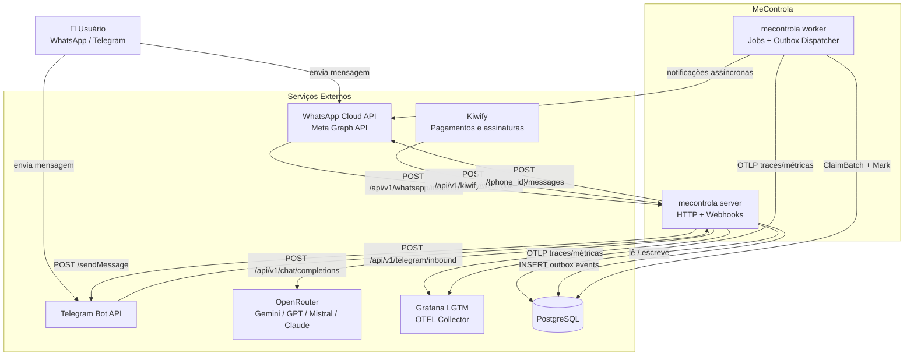
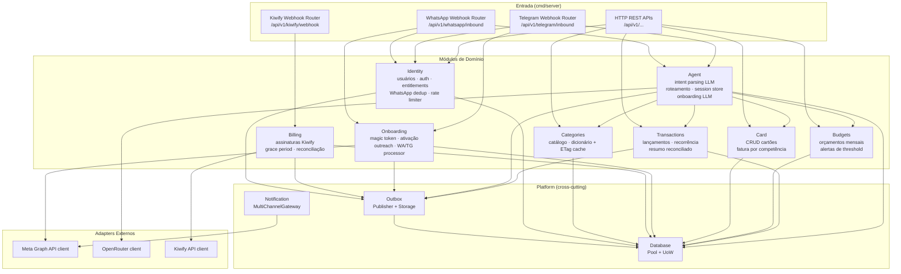

# Visão Geral do Sistema — MeControla

Diagrama de nível macro mostrando os processos, módulos internos e dependências externas.

---

## Contexto Externo

---

## Módulos Internos — Server

---

## Módulos Internos — Worker (Jobs Agendados)

```mermaid
flowchart TB
    subgraph WORKER ["cmd/worker"]
        EVENTS["Event Dispatcher\nHandler Registry"]
    end

    subgraph OUTBOX_JOBS ["Outbox Jobs"]
        J1["OutboxDispatcherJob\n@every 1s\nClaim + dispatch + mark"]
        J2["OutboxReaperJob\ndeleta eventos publicados"]
        J3["OutboxHousekeepingJob\nreset eventos travados"]
    end

    subgraph DOMAIN_JOBS ["Domain Jobs"]
        J4["AuthEventsHousekeepingJob"]
        J5["BillingReconciliationJob"]
        J6["BillingGraceExpirationJob\n@daily"]
        J7["OnboardingOutreachJob"]
        J8["OnboardingExpirationJob"]
        J9["BudgetsThresholdAlertsJob"]
        J10["CardInvoiceDueAlertsJob"]
        J11["RecurringMaterializerJob"]
        J12["MonthlySummaryReconcilerJob"]
    end

    subgraph HANDLERS ["Event Handlers (via Outbox)"]
        H_ID["Identity\nauth events · subscription"]
        H_BILL["Billing\nnotification handlers"]
        H_ONB["Onboarding\nsubscription binding"]
        H_CARD["Card\ncriação ao onboarding"]
        H_BUD["Budgets\npending events"]
        H_TX["Transactions\nmonthly summary recompute"]
    end

    WORKER --> J1
    WORKER --> J2
    WORKER --> J3
    WORKER --> J4
    WORKER --> J5
    WORKER --> J6
    WORKER --> J7
    WORKER --> J8
    WORKER --> J9
    WORKER --> J10
    WORKER --> J11
    WORKER --> J12

    J1 --> EVENTS
    EVENTS --> H_ID
    EVENTS --> H_BILL
    EVENTS --> H_ONB
    EVENTS --> H_CARD
    EVENTS --> H_BUD
    EVENTS --> H_TX
```

