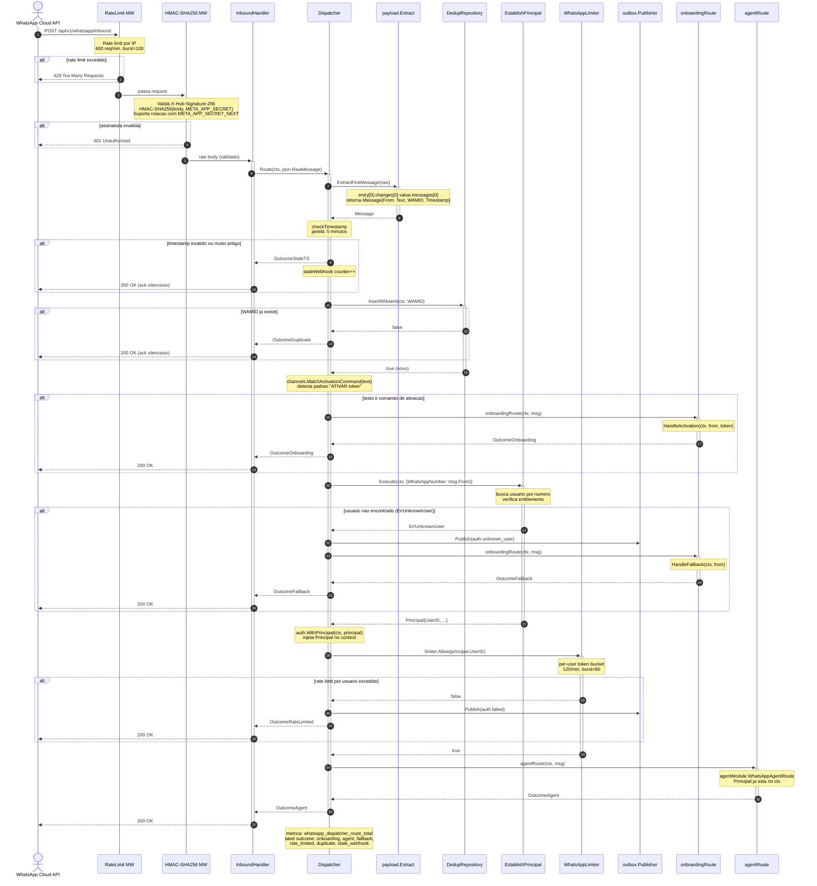
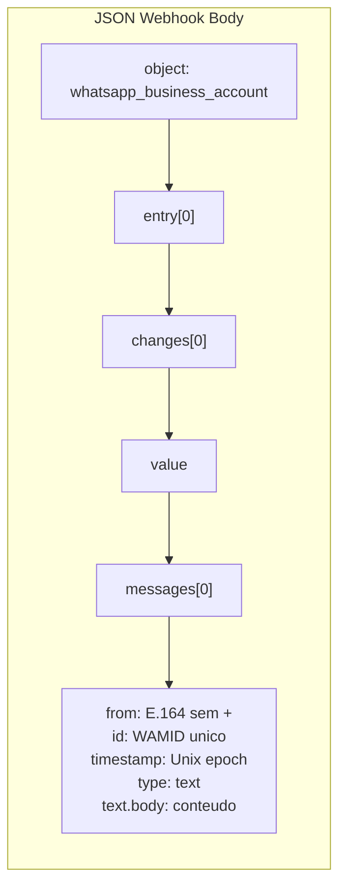
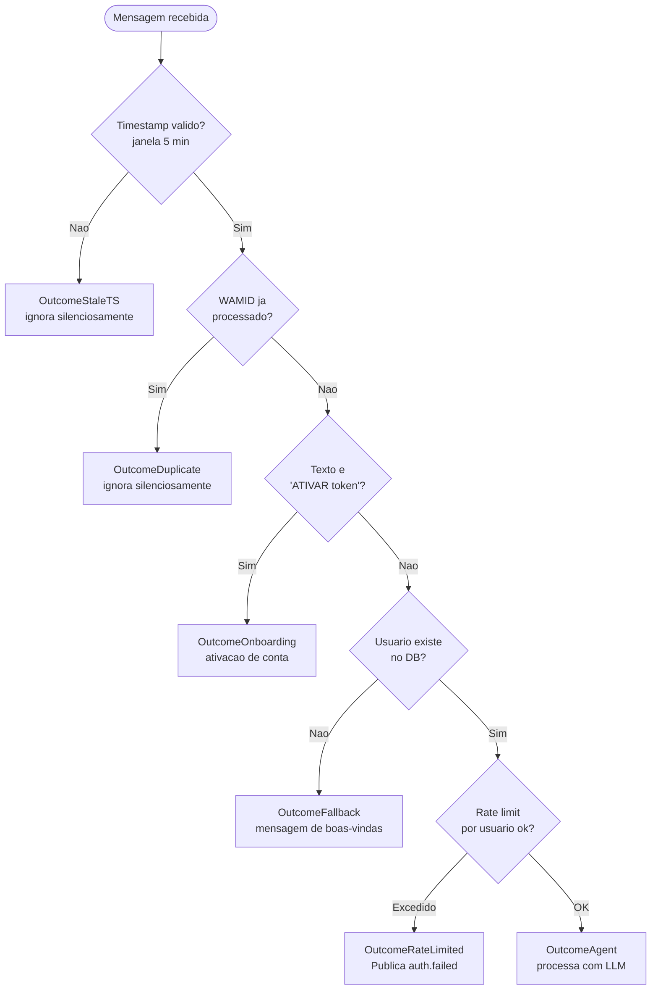

# Fluxo: WhatsApp Webhook → Dispatcher

Diagrama de sequência detalhado do caminho de uma mensagem desde a chegada no webhook até o roteamento final.

## Referências de código

| Componente | Arquivo |
|---|---|
| Router HTTP | `internal/identity/infrastructure/http/server/whatsapp_router.go` |
| Middleware signature | `internal/platform/whatsapp/signature/` |
| Middleware rate limit | `internal/platform/whatsapp/ratelimit/` |
| InboundHandler | `internal/platform/whatsapp/handlers/inbound_handler.go` |
| Dispatcher | `internal/platform/whatsapp/dispatcher/dispatcher.go` |
| Payload parser | `internal/platform/whatsapp/payload/` |
| Dedup | `internal/platform/whatsapp/dedup/` |
| EstablishPrincipal | `internal/identity/application/usecases/establish_principal.go` |
| Wiring | `cmd/server/whatsapp_wiring.go` |

---

## Sequência Completa



---

## Estrutura do Payload Meta Cloud API



---

## Decision Tree dos Outcomes



---

## Configuracao Relevante

```bash
# Webhook security
META_APP_SECRET=<sha256-hmac-key>
META_APP_SECRET_NEXT=<rotacao-opcional>
META_VERIFY_TOKEN=<handshake-GET>

# Rate limits globais (por IP)
WHATSAPP_WEBHOOK_RATE_LIMIT_PER_MIN=600
WHATSAPP_WEBHOOK_RATE_LIMIT_BURST=100

# Rate limit por usuario autenticado
AUTH_RATE_LIMIT_PER_USER_PER_MIN=120
AUTH_RATE_LIMIT_PER_USER_BURST=60
```
