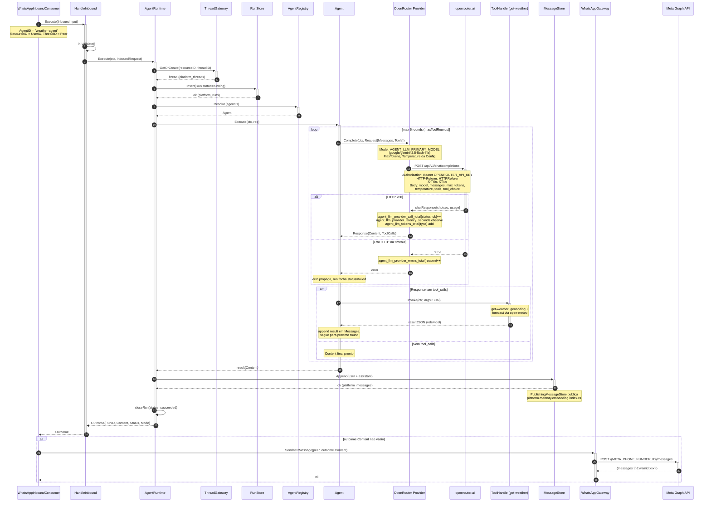
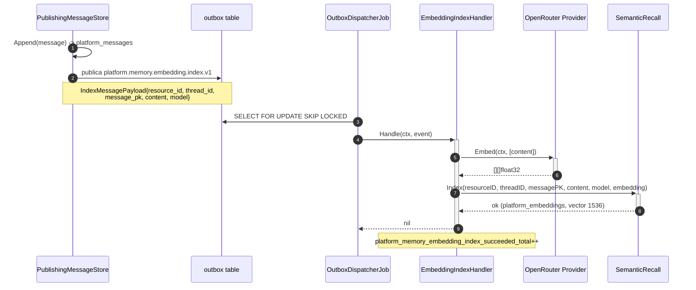
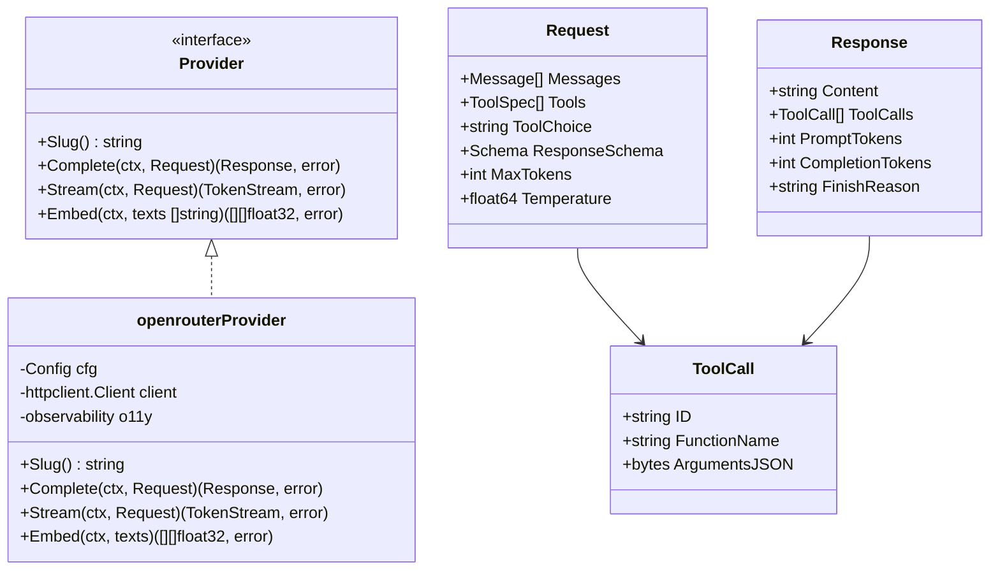
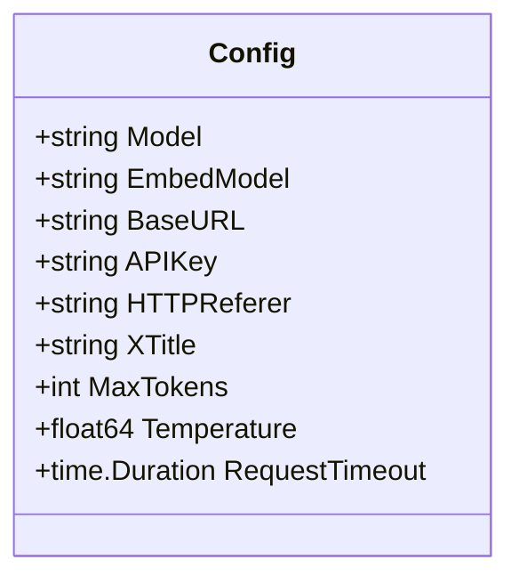

# Fluxo: Agent → LLM → OpenRouter

Diagrama detalhado do processamento de uma mensagem pelo substrato de agent da plataforma, da invocacao do LLM via OpenRouter (provider unico) ate a resposta de volta ao usuario.

> O antigo modulo financeiro de agente (no singular), com roteamento por enum de intent, cadeia de fallback de LLM e disjuntor de circuito, foi removido. O substrato atual vive em `internal/platform/{agent,llm,memory,tool,workflow,scorer}` e e exercitado pelo consumidor de referencia `internal/agents` (port do exemplo Weather do Mastra). Existe **um unico provider LLM** (`llm.NewOpenRouterProvider`); nao ha mais cadeia de fallback nem disjuntor de circuito.

## Referencias de codigo

| Componente | Arquivo |
|---|---|
| Agents module / wiring | `internal/agents/module.go` |
| WhatsApp agent route | `internal/agents/module.go` (`buildWhatsAppAgentRoute`) |
| HandleInbound use case | `internal/agents/application/usecases/handle_inbound.go` |
| WhatsApp inbound consumer | `internal/agents/infrastructure/messaging/database/consumers/whatsapp_inbound_consumer.go` |
| AgentRuntime | `internal/platform/agent/runtime.go` |
| Agent (loop tool-calling) | `internal/platform/agent/agent.go` |
| LLM Provider interface | `internal/platform/llm/provider.go` |
| OpenRouter Provider | `internal/platform/llm/openrouter.go` |
| ToolHandle | `internal/platform/tool/tool.go` |
| Weather client (open-meteo) | `internal/agents/infrastructure/weather/client.go` |
| WhatsApp gateway | `internal/onboarding/infrastructure/gateway/whatsapp_gateway.go` |

---

## Sequencia Completa: Inbound → OpenRouter → Reply



---

## Indexacao Assincrona de Embeddings (Semantic Recall)



---

## Interface llm.Provider



`Stream` alimenta o modo `ExecutionModeStream` do `AgentRuntime`; `Embed` alimenta a indexacao de embeddings para Semantic Recall (pgvector).

---

## Config do OpenRouter Provider



Endpoints internos: `POST /api/v1/chat/completions` (Complete/Stream) e `POST /api/v1/embeddings` (Embed).

---

## Metricas Emitidas

| Metrica | Tipo | Labels | Descricao |
|---------|------|--------|-----------|
| `agent_llm_provider_call_total` | Counter | `model`, `status` | Total de chamadas por modelo |
| `agent_llm_provider_errors_total` | Counter | `model`, `reason` | Erros por tipo |
| `agent_llm_provider_latency_seconds` | Histogram | `model` | Latencia das chamadas |
| `agent_llm_tokens_total` | Counter | `model`, `type` | Tokens prompt/completion |
| `agent_runs_total` | Counter | `agent_id`, `status` | Runs por agente |
| `agent_tool_invocations_total` | Counter | `agent_id`, `tool` | Tool calls invocados |
| `platform_memory_embedding_index_succeeded_total` | Counter | `model` | Embeddings indexados |
| `platform_memory_embedding_index_failed_total` | Counter | `reason` | Falhas de indexacao |

**Cardinalidade controlada:** labels sao enums fechados; sem `user_id`, `resource_id` ou `correlation_key`.

---

## Configuracao Relevante

```bash
OPENROUTER_BASE_URL=https://openrouter.ai
OPENROUTER_API_KEY=sk-or-v1-xxxxx
AGENT_LLM_HTTP_REFERER=https://mecontrola.app
AGENT_LLM_X_TITLE=MeControla

AGENT_LLM_PRIMARY_MODEL=google/gemini-2.5-flash-lite
AGENT_LLM_EMBED_MODEL=openai/text-embedding-3-small

AGENT_LLM_MAX_TOKENS=768
AGENT_LLM_TEMPERATURE=0
```
</content>
