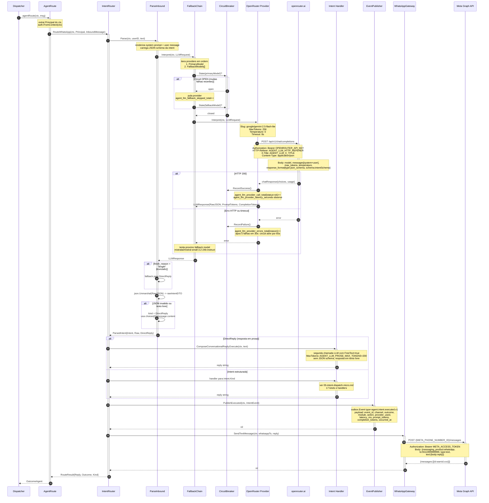
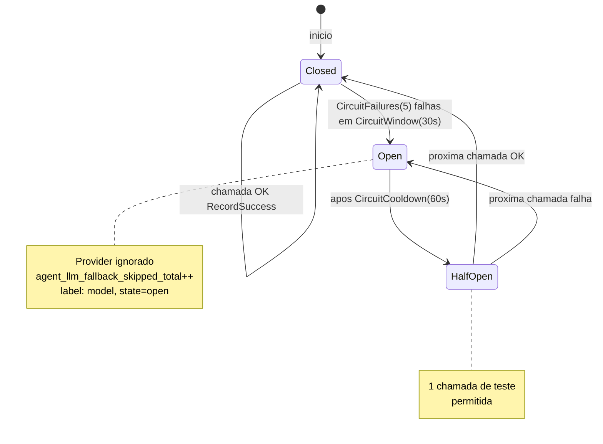
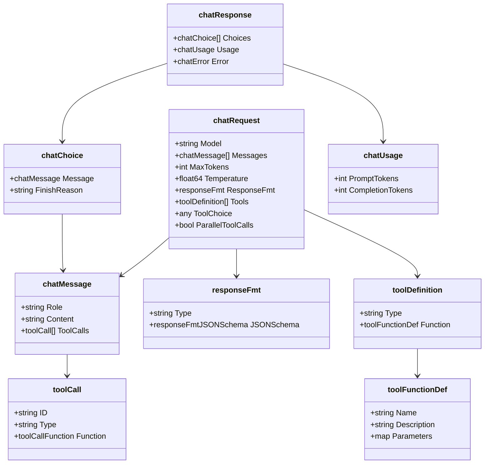
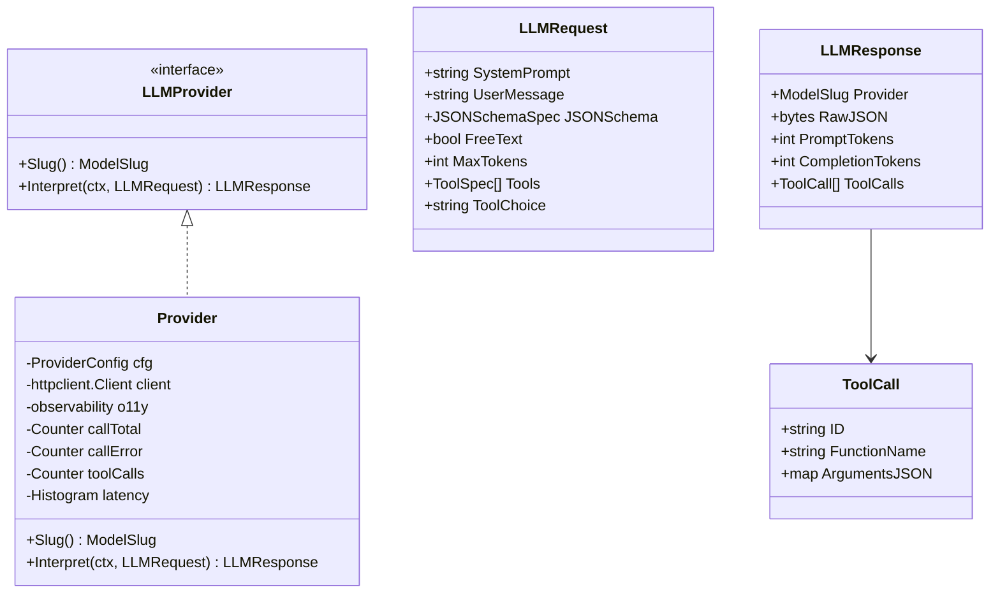

# Fluxo: Agent → LLM → OpenRouter

Diagrama detalhado do processamento de uma mensagem pelo módulo de agent, da invocação do LLM via OpenRouter até a resposta de volta ao usuário.

## Referências de código

| Componente | Arquivo |
|---|---|
| Agent module / wiring | `internal/agent/module.go` |
| WhatsApp agent route | `internal/agent/module.go:425-445` |
| IntentRouter | `internal/agent/application/services/intent_router.go` |
| ParseInbound use case | `internal/agent/application/usecases/parse_inbound.go` |
| ComposeConversationalReply | `internal/agent/application/usecases/compose_conversational_reply.go` |
| FallbackChain | `internal/agent/application/services/fallback_chain.go` |
| OpenRouter client | `internal/agent/infrastructure/providers/openrouter/client.go` |
| LLM interfaces | `internal/agent/application/interfaces/llm_provider.go` |
| Meta client | `internal/onboarding/infrastructure/http/client/meta/client.go` |
| WhatsApp gateway | `internal/onboarding/infrastructure/gateway/whatsapp_gateway.go` |
| Intent event publisher | `internal/agent/infrastructure/events/intent_event_publisher.go` |

---

## Sequência Completa: agentRoute → OpenRouter → Reply



---

## Circuit Breaker — Estados



---

## Structs OpenRouter — Request e Response



---

## Interface LLMProvider



---

## Metricas Emitidas

| Metrica | Tipo | Labels | Descricao |
|---------|------|--------|-----------|
| `agent_llm_provider_call_total` | Counter | `model`, `status` | Total de chamadas por modelo |
| `agent_llm_provider_errors_total` | Counter | `model`, `reason` | Erros por tipo |
| `agent_llm_provider_tool_calls_total` | Counter | `model`, `function` | Tool calls emitidos |
| `agent_llm_provider_latency_seconds` | Histogram | `model` | Latencia (0.1s a 10s) |
| `agent_llm_fallback_attempts_total` | Counter | `model`, `outcome` | Tentativas na chain |
| `agent_llm_fallback_exhausted_total` | Counter | — | Chain esgotada |
| `agent_llm_fallback_skipped_total` | Counter | `model`, `state` | Providers pulados |
| `agent_intent_parsed_total` | Counter | `kind`, `outcome` | Intents por tipo |
| `agent_intent_parse_decode_failed_total` | Counter | `reason` | Falhas de decode |

---

## Configuracao Relevante

```bash
OPENROUTER_BASE_URL=https://openrouter.ai
OPENROUTER_API_KEY=sk-or-v1-xxxxx
AGENT_LLM_HTTP_REFERER=https://mecontrola.app
AGENT_LLM_X_TITLE=MeControla

AGENT_LLM_PRIMARY_MODEL=google/gemini-2.5-flash-lite
AGENT_LLM_FALLBACK_MODELS=mistralai/mistral-small-3.2-24b-instruct

AGENT_LLM_MAX_TOKENS=256
AGENT_LLM_PROSE_MAX_TOKENS=200
AGENT_LLM_TEMPERATURE=0
AGENT_LLM_REQUEST_TIMEOUT=8s
AGENT_LLM_PROMPT_PAD_TOKENS=1100

AGENT_LLM_CIRCUIT_FAILURES=5
AGENT_LLM_CIRCUIT_WINDOW=30s
AGENT_LLM_CIRCUIT_COOLDOWN=60s

AGENT_ONBOARDING_LLM_ENABLED=true
AGENT_ONBOARDING_LLM_MODEL=anthropic/claude-haiku-4.5
AGENT_ONBOARDING_LLM_MAX_TOKENS=512
```
