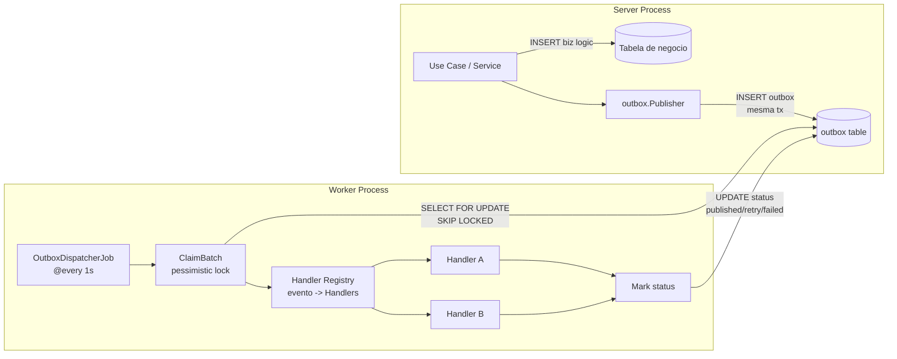
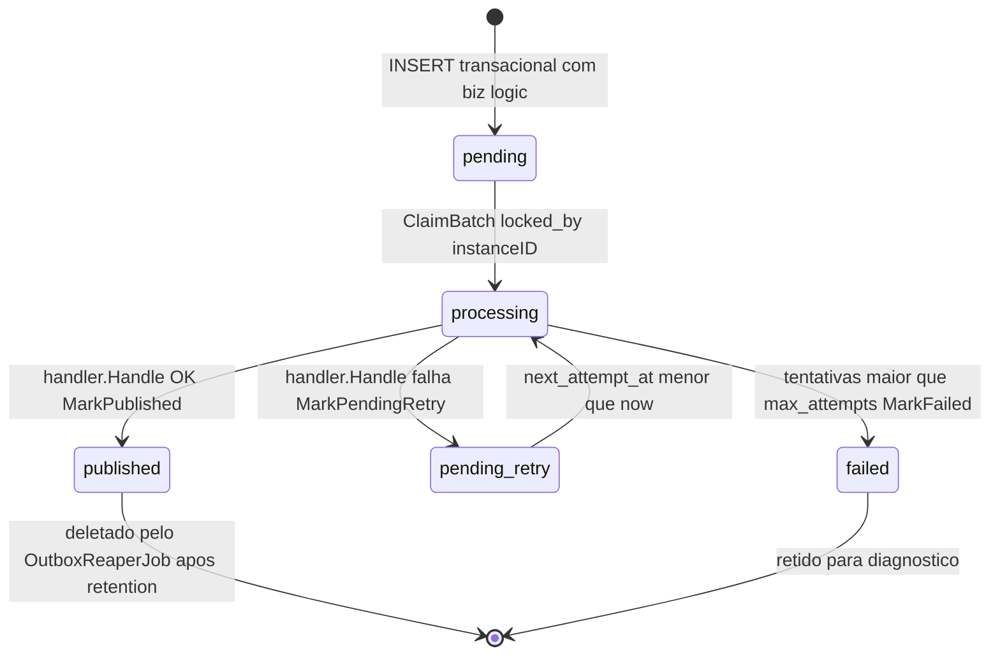
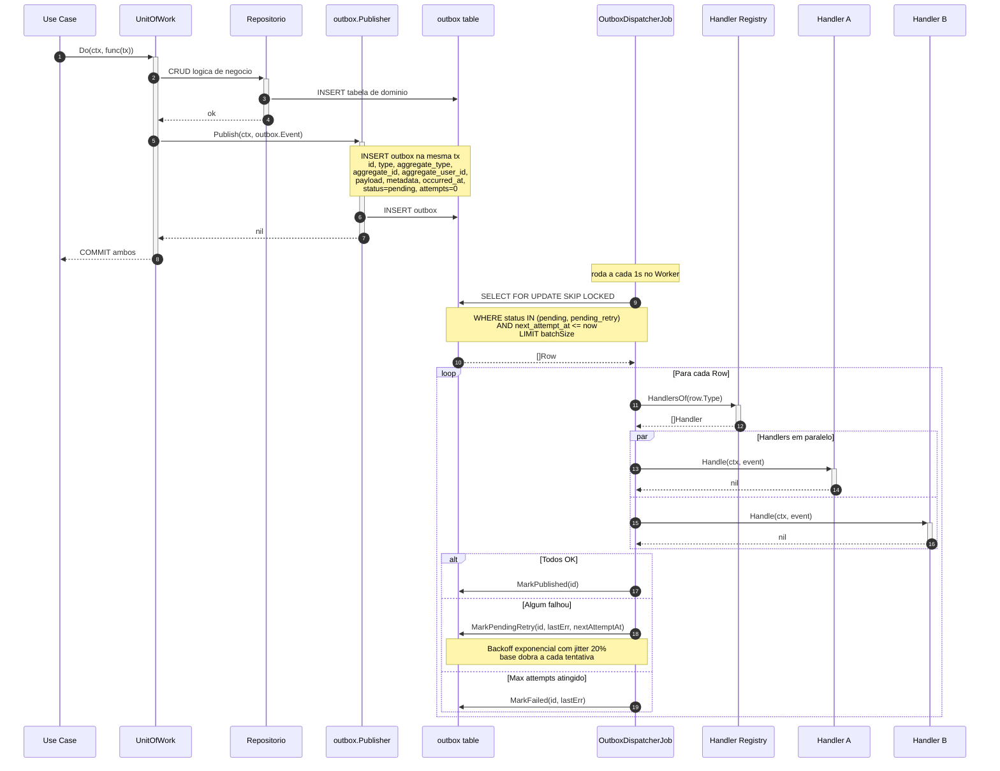
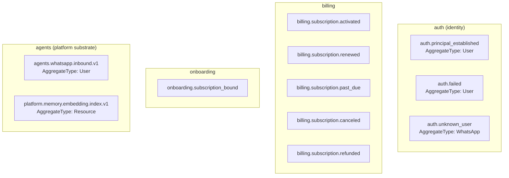
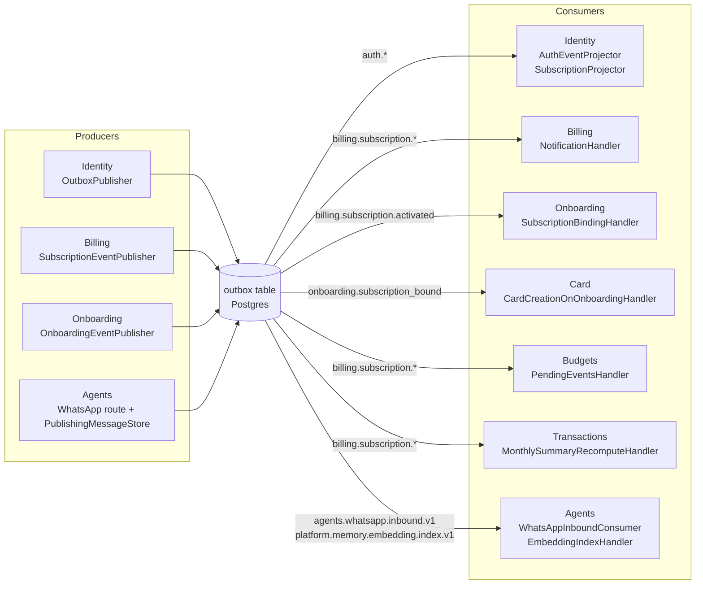
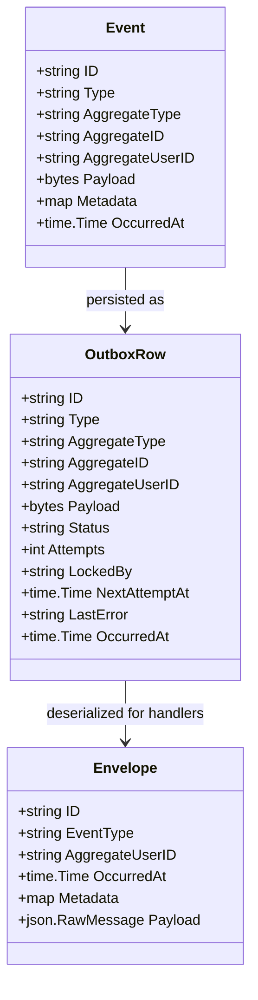

# Comunicacao Entre Modulos — Padrao Outbox

Documentacao do padrao de comunicacao assincrona entre modulos via Transactional Outbox com Postgres.

## Referencias de codigo

| Componente | Arquivo |
|---|---|
| Outbox core | `internal/platform/outbox/outbox.go` |
| Dispatcher job | `internal/platform/outbox/dispatcher.go` |
| Publisher | `internal/platform/outbox/publisher.go` |
| Storage Postgres | `internal/platform/outbox/storage_postgres.go` |
| Envelope | `internal/platform/outbox/envelope.go` |
| Events interface | `internal/platform/events/events.go` |
| Worker bootstrap | `cmd/worker/worker.go` |
| Identity consumers | `internal/identity/infrastructure/messaging/database/consumers/` |
| Billing producers | `internal/billing/infrastructure/messaging/database/producers/` |
| Agents WhatsApp route (producer) | `internal/agents/module.go` (`buildWhatsAppAgentRoute`) |
| Agents inbound consumer | `internal/agents/infrastructure/messaging/database/consumers/whatsapp_inbound_consumer.go` |
| Agents embedding index handler | `internal/platform/memory/infrastructure/indexer/handler.go` |

---

## Visao Geral do Padrao

---

## Ciclo de Vida de um Evento no Outbox

---

## Sequencia: Publicar e Consumir Evento

---

## Todos os Event Types do Sistema

---

## Mapa de Producers para Consumers

---

## Envelope Padrao

---

## Jobs do Worker e Responsabilidades

| Job | Frequencia | Responsabilidade |
|-----|-----------|-----------------|
| `OutboxDispatcherJob` | @every 1s | Claim batch, executa handlers, marca status |
| `OutboxReaperJob` | configuravel | Deleta eventos published apos retention window |
| `OutboxHousekeepingJob` | configuravel | Reset de eventos processing travados |
| `AuthEventsHousekeepingJob` | configuravel | Limpa auth_events antigos |
| `BillingReconciliationJob` | configuravel | Reconcilia assinaturas Kiwify vs DB |
| `BillingGraceExpirationJob` | @daily | Expira assinaturas em grace period (3 dias) |
| `OnboardingOutreachJob` | configuravel | Envia mensagens de outreach (gap min. 2h) |
| `OnboardingExpirationJob` | configuravel | Expira magic tokens apos TTL (7 dias) |
| `BudgetsThresholdAlertsJob` | configuravel | Alertas de threshold de orcamento |
| `CardInvoiceDueAlertsJob` | configuravel | Alertas de fatura vencendo |
| `RecurringMaterializerJob` | configuravel | Materializa transacoes recorrentes |
| `MonthlySummaryReconcilerJob` | configuravel | Reconcilia resumo mensal |
