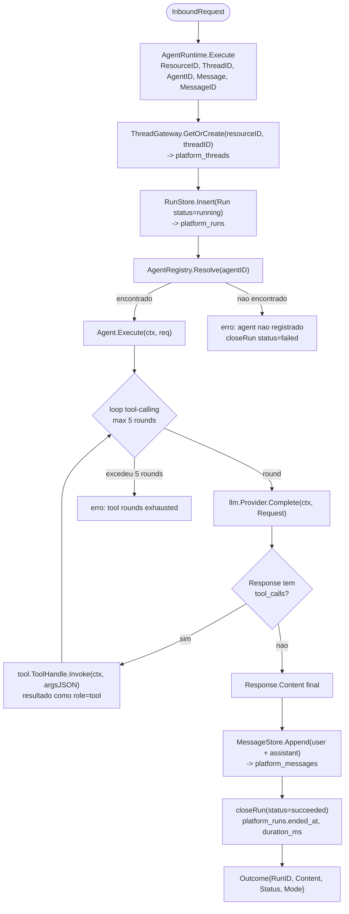
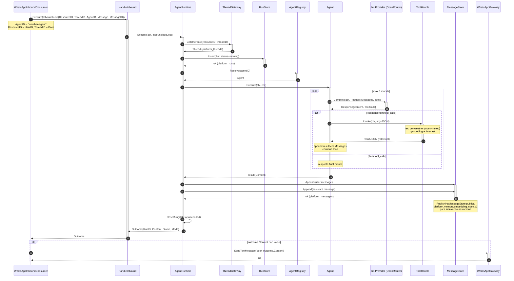
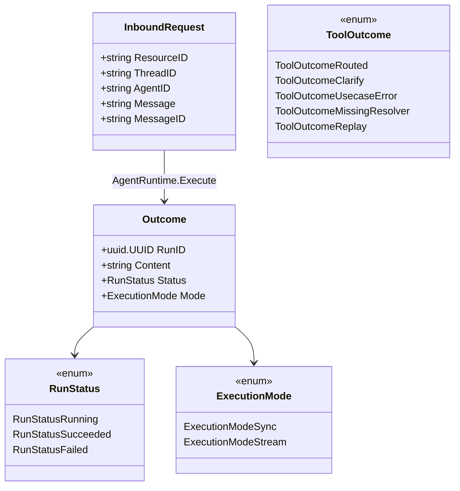
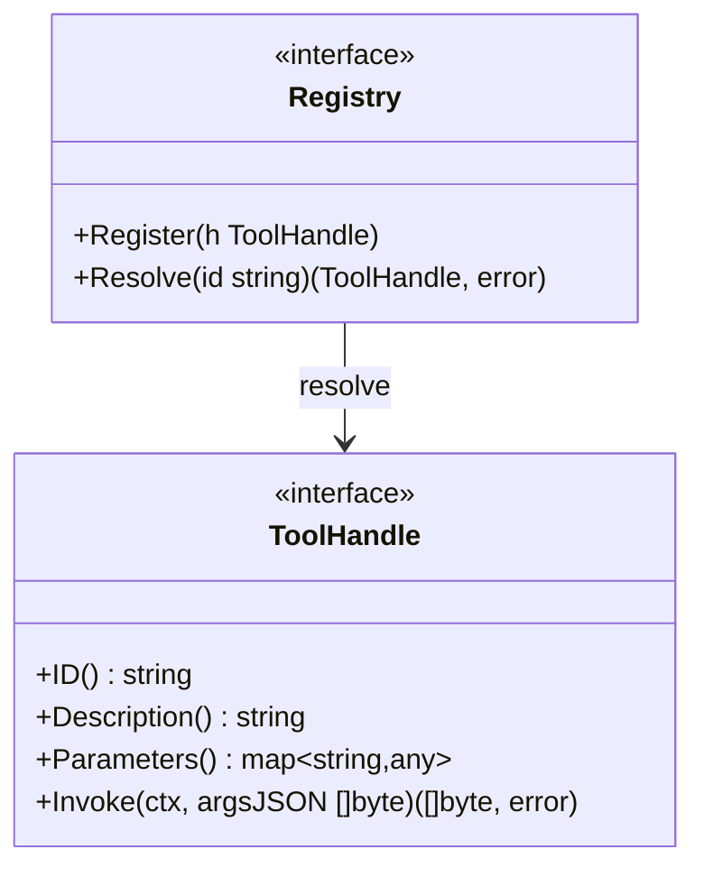

# Agent Tool-Calling Loop — Nivel Micro

> **Nota de descontinuacao.** O mecanismo antigo de roteamento por enum (roteador de intent com 17 kinds e um handler por kind, agente financeiro de ledger diario e rascunho de despesa pendente) foi **removido** junto com o antigo modulo de agente financeiro (no singular). Nao ha mais dispatch por enum. O equivalente atual e o **loop de tool-calling** do `Agent` da plataforma (`internal/platform/agent`), resolvido por `AgentRegistry` e validado no consumidor de referencia `internal/agents` (port do exemplo Weather do Mastra). Este documento descreve esse mecanismo novo. O nome do arquivo e mantido por compatibilidade de links.

Documentacao detalhada do loop de tool-calling executado por `Agent.Execute` dentro do `AgentRuntime`, cobrindo a resolucao por `AgentRegistry`, a invocacao do LLM, o ciclo de tool calls e a persistencia de mensagens.

## Referencias de codigo

| Componente | Arquivo |
|---|---|
| AgentRuntime | `internal/platform/agent/runtime.go` |
| Agent (loop tool-calling) | `internal/platform/agent/agent.go` |
| AgentRegistry | `internal/platform/agent/registry.go` |
| RunStore | `internal/platform/agent/infrastructure/postgres/` |
| ToolHandle | `internal/platform/tool/tool.go` |
| Tool Registry | `internal/platform/tool/registry.go` |
| LLM Provider | `internal/platform/llm/provider.go` |
| Memory ports | `internal/platform/memory/ports.go` |
| HandleInbound use case | `internal/agents/application/usecases/handle_inbound.go` |
| WhatsApp inbound consumer | `internal/agents/infrastructure/messaging/database/consumers/whatsapp_inbound_consumer.go` |
| Weather agent (build) | `internal/agents/application/agents/agent.go` |
| Weather tool (build) | `internal/agents/application/tools/tool.go` |

---

## Resolucao e Loop de Tool-Calling

---

## Sequencia Completa: WhatsApp Inbound → AgentRuntime → Reply

---

## Tipos Fechados (DMMF state-as-type)

`RunStatus`, `ToolOutcome` e `ExecutionMode` sao tipos fechados com constantes enumeradas (DMMF state-as-type). Nunca representados como string livre na fronteira de codigo.

---

## ToolHandle — Contrato

Cada `ToolHandle` e um adapter fino de responsabilidade unica: valida o JSON de entrada contra o schema, executa a funcao de dominio e serializa o resultado. Zero regra de negocio, SQL ou branching de dominio (R-ADAPTER-001 / R-AGENT-WF-001.2). No consumidor de referencia, a tool e `get-weather` (`BuildWeatherTool`), que consulta a API open-meteo via `weather.Client`.

---

## Agent de Referencia: Weather (internal/agents)

| Bloco | Construtor | Identificador |
|------|-----------|---------------|
| Agent | `BuildWeatherAgent` | `weather-agent` |
| Tool | `BuildWeatherTool` | `get-weather` (open-meteo) |
| Workflow | `BuildWeatherWorkflow` | `weather-workflow` (steps `fetch-weather`, `plan-activities`) |
| Scorers | `BuildWeatherScorers` | `tool-call-accuracy`, `completeness`, `translation` (LLM-judged) |

O wiring vive em `internal/agents/module.go`: monta `llm.NewOpenRouterProvider`, registra o agent no `AgentRegistry`, instancia memoria (thread/message/working/embedding), `RunStore`, `ScorerRunner` e o `AgentRuntime`. O canal WhatsApp entra via `WhatsAppInboundConsumer` ouvindo o evento `agents.whatsapp.inbound.v1`.

---

## Metricas Emitidas

| Metrica | Tipo | Labels | Descricao |
|---------|------|--------|-----------|
| `agent_runs_total` | Counter | `agent_id`, `status` | Runs por agente e status |
| `agent_run_duration_seconds` | Histogram | `agent_id` | Duracao do run |
| `agent_tool_invocations_total` | Counter | `agent_id`, `tool` | Tool calls invocados |
| `agent_stream_total` | Counter | `agent_id` | Execucoes em modo stream |
| `agents_whatsapp_inbound_total` | Counter | `channel`, `outcome` | Inbound processados pelo consumer |
| `agents_whatsapp_route_total` | Counter | `outcome` | Mensagens roteadas no server |

**Cardinalidade controlada:** nenhum label de alta cardinalidade (`user_id`, `resource_id`, `correlation_key`). Labels sao enums fechados.
</content>
