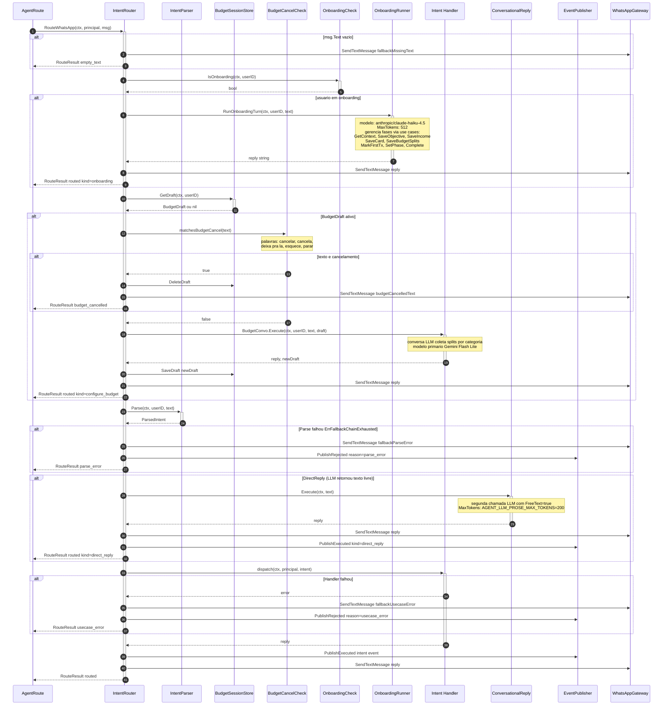
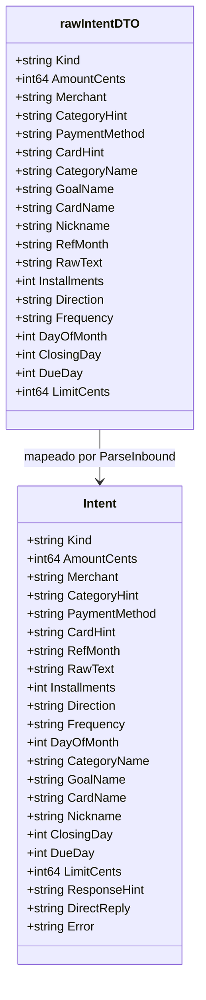
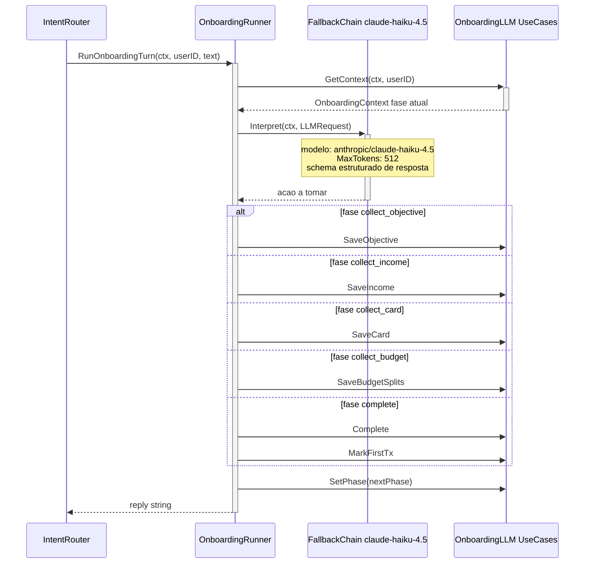
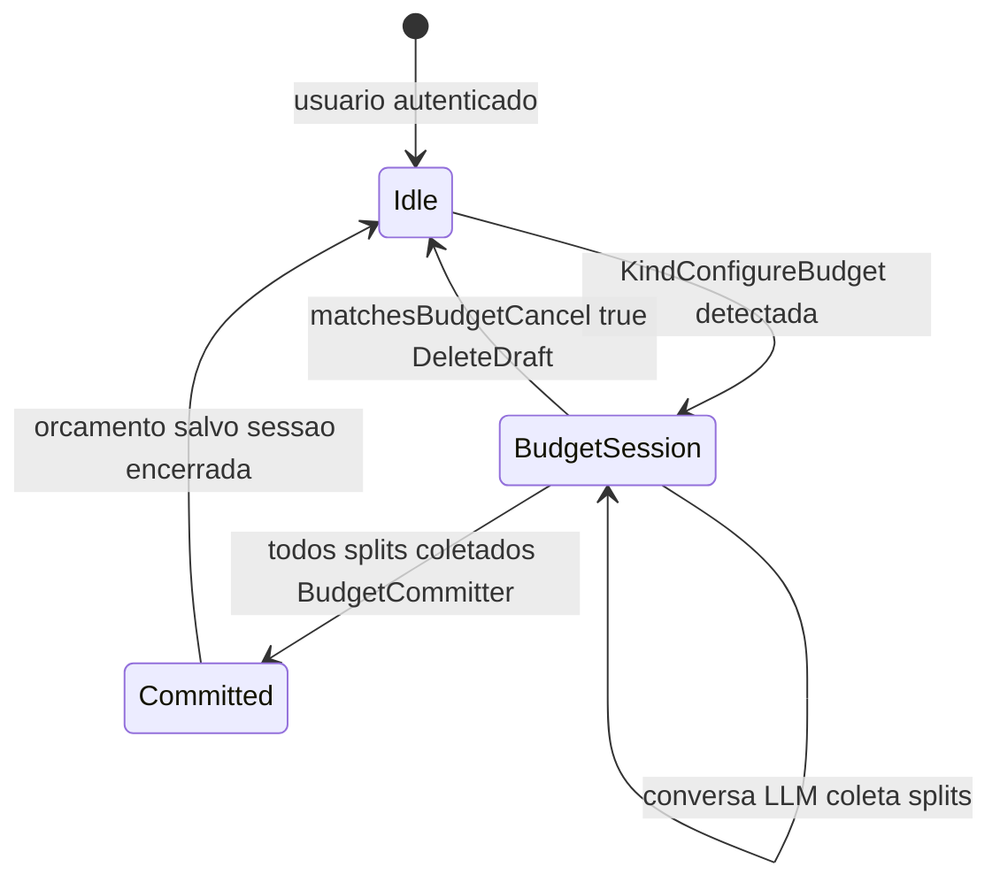

# Intent Dispatch — Nivel Micro

Documentacao detalhada do roteamento de intents dentro do IntentRouter, cobrindo todos os 17 kinds, handlers correspondentes e fluxos especiais (onboarding LLM, budget conversation, fallback).

## Referencias de codigo

| Componente | Arquivo |
|---|---|
| IntentRouter | `internal/agent/application/services/intent_router.go` |
| Intent kinds | `internal/agent/domain/intent/intent.go` |
| ParseInbound | `internal/agent/application/usecases/parse_inbound.go` |
| Agent module (wiring) | `internal/agent/module.go` |
| Budget draft domain | `internal/agent/domain/budgetdraft/` |
| Binding adapters | `internal/agent/infrastructure/binding/` |
| Onboarding runner | `internal/agent/infrastructure/onboarding/` |

---

## Todos os Intent Kinds e Handlers

```mermaid
flowchart TD
    START([ParsedIntent recebida]) --> KIND{intent.Kind}

    KIND -->|KindLogExpense| H1["ExpenseLogger\nlog_transaction_from_agent.go"]
    KIND -->|KindLogIncome| H2["IncomeLogger\nvia ExpenseLogger direction=income"]
    KIND -->|KindLogCardPurchase| H3["CardPurchaseLogger\nlog_card_purchase_from_agent.go"]
    KIND -->|KindQueryCard| H4["CardInvoiceReader + CardLister\nquery_card.go"]
    KIND -->|KindListCards| H5["CardLister\nlist_cards.go"]
    KIND -->|KindCreateCard| H6["CardCreator\ncreate_card.go"]
    KIND -->|KindCountCards| H7["CardCounter\ncount_cards.go"]
    KIND -->|KindMonthlySummary| H8["MonthlySummaryReader\nmonthly_summary.go"]
    KIND -->|KindHowAmIDoing| H9["MonthlySummaryReader\nhow_am_i_doing.go"]
    KIND -->|KindListTransactions| H10["TransactionLister\nlist_transactions.go"]
    KIND -->|KindDeleteLastTransaction| H11["LastDeleter\ndelete_last_transaction.go"]
    KIND -->|KindEditLastTransaction| H12["LastEditor\nedit_last_transaction.go"]
    KIND -->|KindCreateRecurring| H13["RecurringCreator\ncreate_recurring.go"]
    KIND -->|KindListRecurring| H14["RecurringLister\nlist_recurring.go"]
    KIND -->|KindQueryCategory| H15["CategorySearcher\nquery_category.go"]
    KIND -->|KindQueryGoal| H16["GoalReader\nquery_goal.go"]
    KIND -->|KindConfigureBudget| H17["BudgetConvoOrCommitter\nconfigure_budget.go"]
    KIND -->|KindUnknown| H18["FallbackReply\nComposeConversationalReply"]

    H1 & H2 & H3 & H4 & H5 & H6 & H7 & H8 & H9 --> REPLY
    H10 & H11 & H12 & H13 & H14 & H15 & H16 & H17 & H18 --> REPLY

    REPLY["reply string\nWhatsAppGateway.SendTextMessage"]
```

---

## Fluxo Completo do IntentRouter

---

## Tabela Completa: Kind Handler Modulo

| Kind | Handler / Use Case | Modulo | Operacao |
|------|-------------------|--------|---------|
| `KindLogExpense` | `ExpenseLogger` | Transactions | Cria Transaction direction=outcome |
| `KindLogIncome` | `ExpenseLogger` | Transactions | Cria Transaction direction=income |
| `KindLogCardPurchase` | `CardPurchaseLogger` | Transactions | Cria CardPurchase com parcelas |
| `KindQueryCard` | `CardInvoiceReader + CardLister` | Card | Lista cartoes e busca fatura do mes |
| `KindListCards` | `CardLister` | Card | Lista cartoes (limit 200) |
| `KindCreateCard` | `CardCreator` | Card | Cria cartao com closing_day, due_day |
| `KindCountCards` | `CardCounter` | Card | Conta cartoes do usuario |
| `KindMonthlySummary` | `MonthlySummaryReader` | Budgets | Resumo receita/despesa/saldo do mes |
| `KindHowAmIDoing` | `MonthlySummaryReader` | Budgets | Versao conversacional do resumo |
| `KindListTransactions` | `TransactionLister` | Transactions | Lista ultimas N transacoes |
| `KindDeleteLastTransaction` | `LastDeleter` | Transactions | Soft-delete da ultima transacao |
| `KindEditLastTransaction` | `LastEditor` | Transactions | Edita ultima transacao |
| `KindCreateRecurring` | `RecurringCreator` | Transactions | Cria recorrencia com day_of_month |
| `KindListRecurring` | `RecurringLister` | Transactions | Lista recorrencias ativas |
| `KindQueryCategory` | `CategorySearcher` | Categories | Busca categoria por nome |
| `KindQueryGoal` | `GoalReader` | Budgets | Consulta meta/objetivo de orcamento |
| `KindConfigureBudget` | `BudgetConvo / BudgetCommitter` | Budgets | Inicia ou continua config de orcamento |
| `KindUnknown` | `ComposeConversationalReply` | Agent LLM | Resposta livre via LLM |

---

## rawIntentDTO — Schema da Resposta LLM

---

## Fluxo Especial: Onboarding com LLM

---

## State Machine: Budget Configuration (Sessao Multi-turn)

---

## Textos de Fallback

| Situacao | Texto |
|----------|-------|
| Mensagem vazia | Nao recebi nenhuma mensagem. Me conta o que voce precisa nas suas financas |
| Erro de parse LLM | Nao entendi direito. Pode reformular? Posso te ajudar com cartoes, orcamento e lancamentos. |
| Erro em use case | Tive uma instabilidade para consultar isso agora. Tente de novo em instantes |
| Registro indisponivel | Ainda nao consigo registrar lancamentos por aqui. Ja ja isso fica disponivel pra voce |
| Sem transacoes | Nao encontrei nenhum lancamento recente seu para mexer. Quer registrar um agora? |
| Budget cancelado | Ok, cancelei a configuracao do orcamento. Quando quiser, e so chamar de novo. |

---

## RouteResult Outcomes

| Outcome | Significado |
|---------|------------|
| `routed` | Intent processada e resposta enviada com sucesso |
| `fallback` | Resposta via LLM conversacional kind=unknown |
| `parse_error` | FallbackChain esgotada, enviou mensagem de erro |
| `usecase_error` | Use case falhou, enviou mensagem de instabilidade |
| `missing_resolver` | Canal sem gateway configurado |
| `reply_failed` | Gateway de envio falhou |
| `empty_text` | Mensagem vazia recebida |
