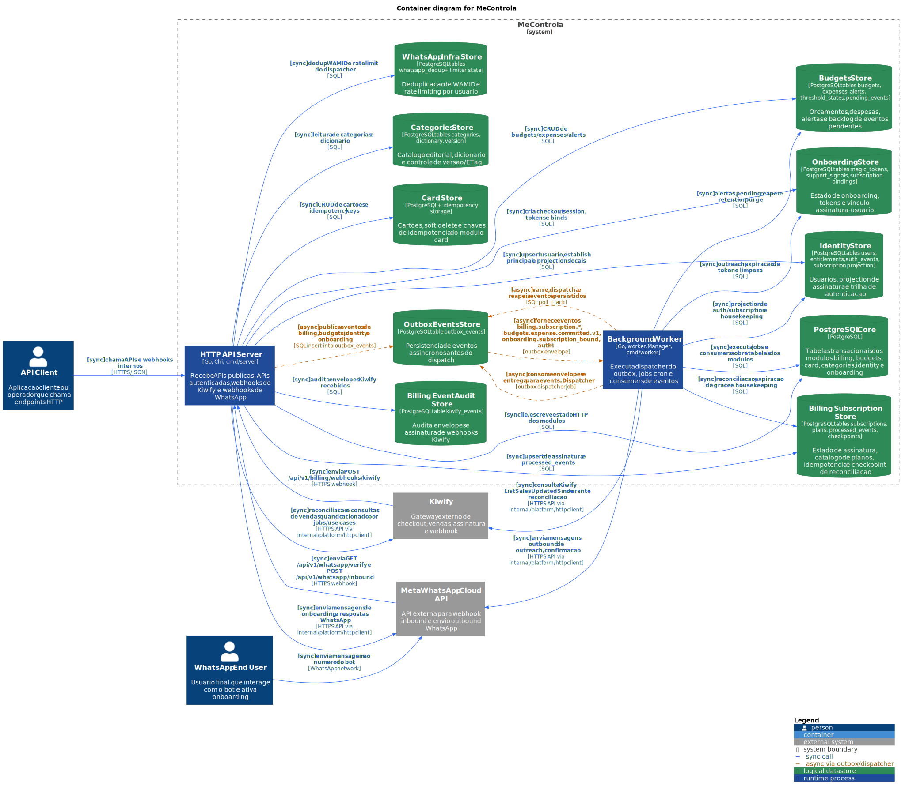

# Billing Flows

## Objetivo do modulo

`internal/billing` recebe webhooks da Kiwify, persiste o estado de assinatura, reconcilia divergencias com a API externa, mantem idempotencia de eventos e publica eventos de assinatura para os demais modulos.

## Arquivos .puml por fluxo

- [BIL-01-webhook-to-subscription-event.puml](./BIL-01-webhook-to-subscription-event.puml)
- [BIL-02-reconciliation.puml](./BIL-02-reconciliation.puml)
- [BIL-03-grace-expiration.puml](./BIL-03-grace-expiration.puml)
- [BIL-04-kiwify-housekeeping.puml](./BIL-04-kiwify-housekeeping.puml)
- [BIL-05-notification-consumer.puml](./BIL-05-notification-consumer.puml)

## Entradas, saidas e artefatos

### Entradas

- Endpoint HTTP: `POST /api/v1/billing/webhooks/kiwify`
- Job: `billing-reconciliation`
- Job: `billing-grace-expiration`
- Job: `billing-kiwify-events-housekeeping`
- Consumer async: `billing.subscription.past_due`
- Consumer async: `billing.subscription.refunded`
- Consumer async: `billing.subscription.expired_after_grace`

### Saidas

- Escrita em `kiwify_events`
- Escrita em `subscriptions`, `plans`, `processed_events`, `reconciliation_checkpoints`
- Publicacao em `outbox_events` de:
  - `billing.subscription.activated`
  - `billing.subscription.activated_without_token`
  - `billing.subscription.renewed`
  - `billing.subscription.past_due`
  - `billing.subscription.canceled`
  - `billing.subscription.refunded`
  - `billing.subscription.expired_after_grace`

### Dependencias externas

- `Kiwify` via webhook inbound e API outbound

## Matriz de fluxos

| ID | Origem | Tipo | Saida principal |
| --- | --- | --- | --- |
| BIL-01 | `POST /api/v1/billing/webhooks/kiwify` | sync + async | Atualiza assinatura e publica evento de subscription |
| BIL-02 | `billing-reconciliation` | sync + async | Consulta Kiwify, corrige estado local e republica eventos quando necessario |
| BIL-03 | `billing-grace-expiration` | sync + async | Expira assinaturas apos grace e publica `billing.subscription.expired_after_grace` |
| BIL-04 | `billing-kiwify-events-housekeeping` | sync | Purga auditoria antiga de envelopes |
| BIL-05 | consumer `billing.subscription.past_due|refunded|expired_after_grace` | async | Aciona fluxo de notificacao interno |

## Percurso detalhado

### BIL-01 - Webhook Kiwify ate evento de dominio

Origem:
- `WebhookRouter.Register` expõe `POST /api/v1/billing/webhooks/kiwify`

Percurso:
1. `middleware.RawBody` preserva o payload bruto para validacao e auditoria.
2. `middleware.HMACSignature` valida a assinatura com `WebhookSecret` ou `WebhookSecretNext`.
3. `handlers.KiwifyWebhookHandler.Handle` monta `ProcessKiwifyWebhookInput`.
4. `usecases.ProcessKiwifyWebhook.Execute`:
   - decodifica o payload com `kiwifypayload.Decode`;
   - classifica o trigger com `kiwifypayload.Classify`;
   - persiste o envelope bruto em `KiwifyEventRepository.Persist`;
   - rejeita assinatura invalida;
   - escolhe o handler correto por trigger.
5. Triggers sem efeito de negocio imediato (`billet_created`, `pix_created`, `order_rejected`, `abandoned_cart`) param em `noopTrigger`.
6. Triggers com efeito de negocio chamam use cases especificos:
   - `order_approved` -> `ProcessSaleApproved`
   - `subscription_renewed` -> `ProcessSubscriptionRenewed`
   - `subscription_late` -> `ProcessSubscriptionLate`
   - `subscription_canceled` -> `ProcessSubscriptionCanceled`
   - `order_refunded` e `chargeback` -> `ProcessRefundOrChargeback`
7. O use case de negocio executa uma transacao:
   - marca o evento em `ProcessedEventRepository.MarkApplied`;
   - consulta plano em `PlanRepository`;
   - faz upsert de assinatura em `SubscriptionRepository`;
   - publica evento correspondente pelo `SubscriptionEventPublisher`.
8. O producer serializa o payload e grava em `outbox_events`.
9. O request HTTP termina sem esperar o consumo dos modulos downstream.

Banco:
- Leitura/escrita em `kiwify_events`
- Leitura/escrita em `processed_events`
- Leitura em `plans`
- Escrita/upsert em `subscriptions`
- Escrita em `outbox_events`

Direcionamento:
- `billing.subscription.activated` e variantes seguem para `identity`, `onboarding` e handlers do proprio `billing` via worker.

### BIL-02 - Reconciliacao

Origem:
- Job `billing-reconciliation`
- Schedule: `cfg.KiwifyConfig.ReconciliationInterval`

Percurso:
1. `ReconciliationJob.Run` chama `RunReconciliation.Execute`.
2. `RunReconciliation` le checkpoint `kiwify_sales`.
3. Se checkpoint nao existir, usa lookback padrao de `1h`.
4. Calcula janela com overlap de `15m`.
5. Chama `ReconcileSubscriptions.Execute`.
6. O reconciliador pagina `ListSalesUpdatedSince` na API da Kiwify.
7. Para cada venda:
   - `refunded` e `chargedback` -> `ProcessRefundOrChargeback`
   - `paid` e `approved` -> `ProcessSaleApproved`
8. Eventos ja processados ou superados sao ignorados.
9. Ao final, o checkpoint e atualizado em `ReconciliationCheckpointRepository.Set`.

Banco:
- Leitura/escrita em `reconciliation_checkpoints`
- Leitura/escrita em `subscriptions`, `processed_events`, `outbox_events`

Sistema externo:
- `KiwifyClient.ListSalesUpdatedSince`

### BIL-03 - Expiracao de grace

Origem:
- Job `billing-grace-expiration`
- Schedule: `cfg.BillingConfig.GraceExpirationSchedule` ou `@every 30m`

Percurso:
1. O job chama `ProcessSubscriptionGraceExpired.Execute`.
2. O use case identifica assinaturas que passaram do `grace_end`.
3. Atualiza o estado da assinatura.
4. Publica `billing.subscription.expired_after_grace` via outbox.

Banco:
- Leitura/escrita em `subscriptions`
- Escrita em `outbox_events`

### BIL-04 - Housekeeping de envelopes Kiwify

Origem:
- Job `billing-kiwify-events-housekeeping`
- Schedule: `cfg.BillingConfig.KiwifyEventsHousekeepingSchedule` ou `@daily`

Percurso:
1. O job chama `CleanupKiwifyEvents.Execute`.
2. O use case remove auditoria antiga ou excedente.
3. Nenhum evento de dominio e emitido.

Banco:
- Escrita/purga em `kiwify_events`

### BIL-05 - Consumer de notificacao

Origem:
- Worker consome `billing.subscription.past_due`
- Worker consome `billing.subscription.refunded`
- Worker consome `billing.subscription.expired_after_grace`

Percurso:
1. `events.Dispatcher` resolve `NotificationHandler`.
2. `NotificationHandler.Handle` extrai `outbox.Envelope`.
3. Encaminha para `SendSubscriptionNotification.Execute`.
4. O input preserva `EventType` e `Payload`.
5. No estado atual, `NotificationSender` do modulo e `noopNotificationSender`, portanto o fluxo e fino e sem integracao externa ativa.

## Rotas internas e dependencias cruzadas

- `identity` consome:
  - `billing.subscription.activated`
  - `billing.subscription.renewed`
  - `billing.subscription.past_due`
  - `billing.subscription.canceled`
  - `billing.subscription.refunded`
- `onboarding` consome:
  - `billing.subscription.activated`
  - `billing.subscription.activated_without_token`
- `billing` consome internamente:
  - `billing.subscription.past_due`
  - `billing.subscription.refunded`
  - `billing.subscription.expired_after_grace`

## Observacoes arquiteturais

- O webhook sempre audita o envelope em `kiwify_events` antes da decisao final.
- A idempotencia de negocio ocorre em `processed_events`.
- A publicacao assincrona usa outbox persistente; o request do webhook nao depende do worker para concluir.
- O modulo publica um evento separado para pagamentos sem funnel token: `billing.subscription.activated_without_token`.

## Eficiencia, robustez e operacao

- `Caminho critico`
  - BIL-01 e dominado por IO de banco; a chamada externa nao ocorre no webhook normal.
  - BIL-02 e dominado por API Kiwify + paginação + upserts locais.
- `Controles de robustez`
  - assinatura HMAC na borda;
  - auditoria do raw payload em `kiwify_events`;
  - idempotencia de negocio em `processed_events`;
  - outbox para desacoplar downstream do request sincrono.
- `Falhas esperadas`
  - webhook com assinatura invalida: falha definitiva, sem processamento de negocio;
  - plano inexistente ou funnel token invalido: falha definitiva de dominio;
  - erro de banco ou publish no outbox: falha transiente, request falha e pode ser reentregue pela fonte;
  - erro na reconciliacao Kiwify: falha transiente do job, retomada pelo proximo schedule.
- `Observabilidade`
  - counters de webhook recebido, carrier de tracking e secret rotacionado;
  - logs estruturados em persistencia de envelope, falha de reconciliacao e max page guard;
  - checkpoint `kiwify_sales` como ancora operacional de retomada.
- `Capacidade`
  - reconciliacao precisa vigilancia de janela, overlap e volume por pagina;
  - crescimento de `kiwify_events` e `processed_events` exige housekeeping continuo.

## Guardrails operacionais

### Precondicoes e pos-condicoes

- `BIL-01`
  - pre: segredo HMAC configurado, plano previamente catalogado, banco disponivel;
  - pos: envelope auditado, estado de assinatura persistido ou request rejeitado de forma deterministica, evento no outbox quando houver transicao valida.
- `BIL-02`
  - pre: checkpoint legivel e credenciais Kiwify validas;
  - pos: janela reconciliada e checkpoint atualizado apenas apos sucesso.
- `BIL-03`
  - pre: subscriptions com `grace_end` consistente;
  - pos: assinaturas vencidas apos grace publicam evento de expiracao.

### Invariantes

- o mesmo `event_key` nao pode ser aplicado duas vezes em `processed_events`;
- toda mudanca relevante de subscription deve resultar em no maximo um envelope coerente no outbox;
- `kiwify_events` e trilha de auditoria, nunca fonte de verdade de estado de subscription.

### Runbook resumido

- webhook falhando com 5xx:
  - verificar conectividade e saturacao do PostgreSQL;
  - consultar crescimento e erro em `kiwify_events.persist_failed`;
  - confirmar se `processed_events` ou `subscriptions` estao com lock/conflito.
- reconciliacao atrasada:
  - comparar `checkpoint` com horario atual;
  - validar credenciais e rate limit da Kiwify;
  - inspecionar se o job parou por `max_pages_reached`.
- expiracao de grace nao ocorre:
  - conferir `GraceExpirationSchedule`;
  - consultar subscriptions elegiveis sem evento `expired_after_grace`.

### Sinais e thresholds recomendados

- alerta se `billing_webhooks_received_total` cair abruptamente por janela de negocio;
- alerta se `billing_webhook_signature_rotated_total` subir acima do baseline esperado;
- alerta se checkpoint de reconciliacao atrasar mais que `2x` o intervalo configurado;
- alerta se backlog de `outbox_events` de billing crescer continuamente por mais de 15 minutos.
