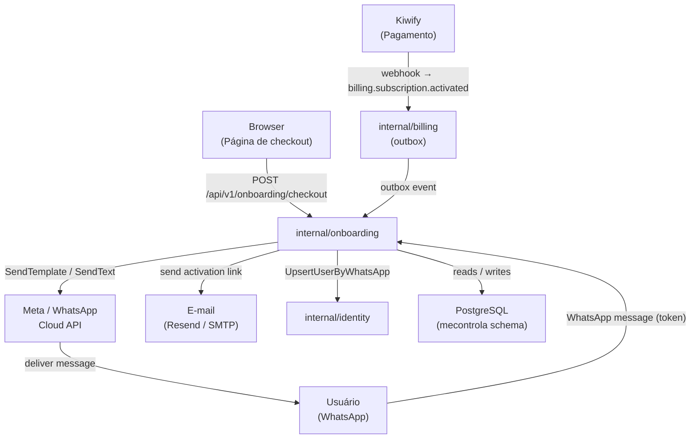
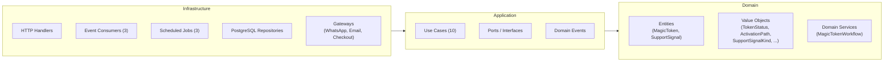
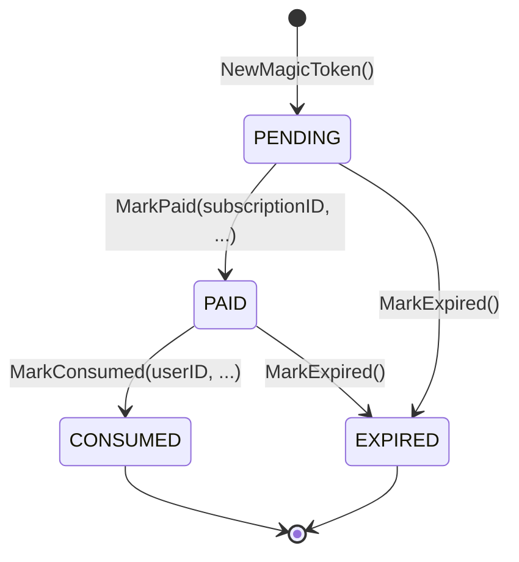
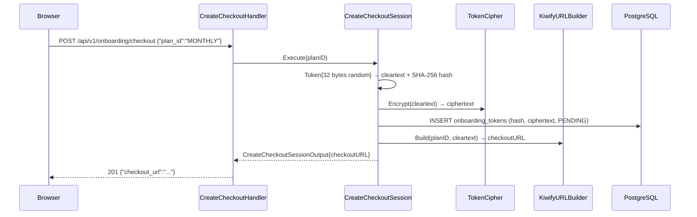
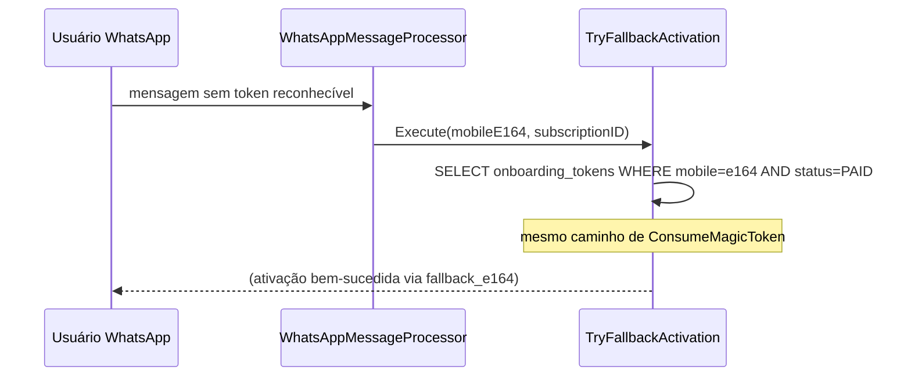
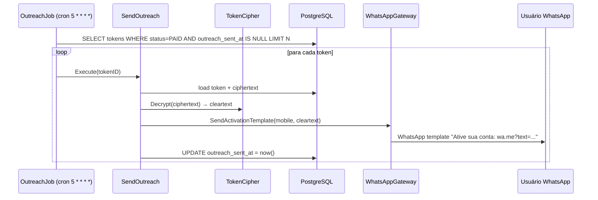
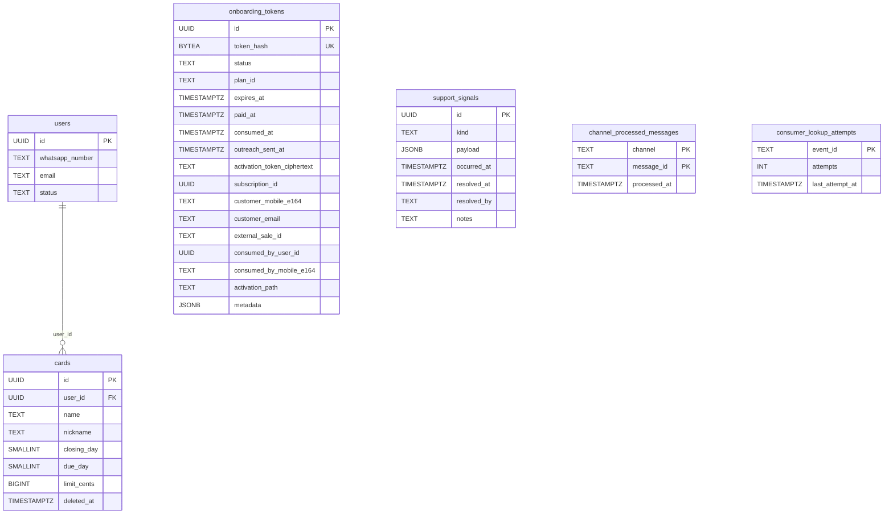

# Onboarding Module

> **Schema:** `mecontrola` · **Canal:** WhatsApp · **Go module:** `internal/onboarding`

## Índice de leitura por audiência

| Audiência | Seções recomendadas |
|-----------|---------------------|
| Novo desenvolvedor | §1 → §2 → §3 → §4 → §6 → §7 → §8 |
| Ops / on-call | §1 → §5 → §9 → §11 → §12 → §13 → §14 |
| Equipe de integração | §1 → §2 → §5 → §8 → §10 → §15 |

---

## 1. Propósito e Responsabilidade

O módulo `internal/onboarding` é o dono do **ciclo de vida do MagicToken e do funil de ativação de novos usuários**: desde a geração do link de checkout Kiwify até a vinculação da assinatura ao usuário recém-criado.

### O que este módulo faz

- Gera e armazena `MagicToken`s vinculados a planos de assinatura Kiwify
- Responde a eventos de pagamento do billing (`billing.subscription.activated`) para transicionar tokens ao estado `PAID`
- Envia e-mail com link de ativação ao cliente após o pagamento
- Executa outreach proativo via WhatsApp para tokens `PAID` ainda não consumidos
- Processa a mensagem de ativação do WhatsApp e vincula a assinatura ao usuário recém-criado
- Emite o evento de domínio `onboarding.subscription_bound` consumido por outros módulos
- Registra `SupportSignal`s para anomalias operacionais que requerem intervenção humana
- Expira tokens obsoletos e limpa tabelas de deduplicação por meio de jobs agendados

### O que este módulo **não** faz

- Não cria nem cancela assinaturas Kiwify — isso pertence ao módulo `billing`
- Não contém lógica LLM — fornece use cases que a camada de agente (`internal/agents`) consome
- Não persiste o perfil financeiro pós-onboarding (orçamento ativo, lançamentos, relatórios)
- Não autentica requisições HTTP — os endpoints de checkout são públicos por design

---

## 2. Visão Arquitetural

### C4 — Contexto de sistema



### Camadas hexagonais



### Padrões aplicados

| Padrão | Onde |
|--------|------|
| Hexagonal Architecture | Separação domain / application / infrastructure |
| DMMF — Decide* puro | `MagicTokenWorkflow.DecideMarkPaid()`, `DecideConsume()` — sem IO, sem `time.Now()` |
| Transactional Outbox | Todos os domain events publicados via `outbox.Publisher` dentro da mesma transação |
| Unit of Work | Use cases recebem UoW; escrita coordenada entre tabelas |
| Port & Adapter | Gateways (WhatsApp, email, identity) definidos como interfaces na camada application |
| State-as-type | `TokenStatus`, `ActivationPath`, `SupportSignalKind` — tipos fechados, nunca `string` livre |
| Smart Constructors | `NewMagicToken()`, `NewToken()` — validam invariantes na criação |
| Manual DI | `NewOnboardingModule()` em `module.go` — sem framework de injeção |

---

## 3. Linguagem Ubíqua

| Termo | Definição |
|-------|-----------|
| **MagicToken** | Link de ativação gerado no checkout. Contém o hash do token (SHA-256) e metadados do pagamento. Ciclo de vida: `PENDING → PAID → CONSUMED` (ou `EXPIRED`) |
| **ActivationPath** | Como o token foi ativado: `direct` (link normal), `fallback_e164` (busca por celular), `outreach` (template WhatsApp), `admin` (manual) |
| **SupportSignal** | Anomalia operacional registrada para resolução humana: `orphan_expired_subscription`, `paid_without_token`, `token_reuse_attempt` |
| **Outreach** | Envio proativo via template WhatsApp para usuários que pagaram mas não ativaram o token |
| **Token cleartext** | Valor aleatório de 32 bytes em Base64-URL — nunca gravado no banco; apenas o hash SHA-256 é persistido |
| **Token ciphertext** | `cleartext` criptografado com AES-GCM — armazenado na coluna `activation_token_ciphertext` e enviado no e-mail |

---

## 4. Mapa de Arquivos

```
internal/onboarding/
├── module.go                              # DI container — NewOnboardingModule()
├── domain/
│   ├── entities/
│   │   ├── magic_token.go                 # Agregado MagicToken + state machine
│   │   ├── support_signal.go              # Agregado SupportSignal
│   │   └── events.go                      # SubscriptionBound (domain event)
│   ├── valueobjects/
│   │   ├── token.go / token_status.go / token_hash_prefix.go
│   │   └── activation_path.go / support_signal_kind.go
│   ├── services/
│   │   └── magic_token_workflow.go        # Decide* puro: DecideMarkPaid, DecideConsume
│   └── errors.go                          # Sentinelas de domínio
├── application/
│   ├── usecases/                          # 10 use cases (ver §6)
│   ├── dtos/input/ / dtos/output/
│   ├── interfaces/                        # Ports: repositórios, gateways, cipher
│   ├── binding/subscription_binding.go    # BindAndConsume — orquestra identity + subscription
│   ├── events/subscription_bound.go       # Envelope do evento para outbox
│   └── errors.go                          # Sentinelas de aplicação
└── infrastructure/
    ├── http/server/
    │   ├── router.go                      # Registro de rotas + rate limit + CORS
    │   ├── handlers/create_checkout_handler.go
    │   ├── handlers/token_state_handler.go
    │   └── middleware/rate_limit.go
    ├── http/client/meta/                  # HTTP client Meta/WhatsApp API
    ├── messaging/database/consumers/      # 3 consumers de outbox
    ├── jobs/handlers/                     # 3 job handlers
    ├── repositories/postgres/             # repositórios + subscription binder
    ├── gateway/whatsapp_gateway.go
    ├── email/                             # Factory + SMTP + Resend
    ├── crypto/token_cipher.go             # AES-GCM
    ├── checkout/kiwify_url_builder.go
    └── config/runtime.go
```

---

## 5. Entry Points

### 5.1 HTTP (Público)

Ambos os endpoints são públicos (sem autenticação). Rate limiting por IP com suporte a trusted proxies (`X-Real-IP`, `X-Forwarded-For`).

#### `POST /api/v1/onboarding/checkout`

Gera um link de checkout Kiwify com o token de ativação embutido.

**Request**
```json
{ "plan_id": "MONTHLY" }
```

**Response `201 Created`**
```json
{ "checkout_url": "https://pay.kiwify.com.br/..." }
```

**Erros**

| Status | Código | Condição |
|--------|--------|----------|
| `400` | `unknown_plan` | `plan_id` não está no mapa de planos configurado |
| `400` | — | Body inválido ou `plan_id` vazio |
| `503` | `checkout_unavailable` | Construção da URL falhou |
| `429` | — | Rate limit atingido |

---

#### `GET /api/v1/onboarding/tokens/{token}/state`

Consulta o estado do token para a página de ativação (polling do frontend).

**Path param:** `token` — cleartext Base64-URL do magic token

**Response `200 OK`**
```json
{
  "ready_to_activate": true,
  "wa_me_url": "https://wa.me/5511...",
  "bot_number_display": "+55 11 9XXXX-XXXX",
  "support_url": "https://...",
  "reason": ""
}
```

> Quando `ready_to_activate = false`, o campo `reason` indica o motivo (`not_paid`, `expired`, `already_consumed`). A resposta inclui um jitter criptográfico de 5–25ms para mitigar timing attacks.

**Header:** `Cache-Control: no-store` sempre presente.

---

### 5.2 Consumers (Event-Driven)

Todos os consumers lêem do outbox PostgreSQL (at-least-once delivery). Deduplicação via `consumer_lookup_attempts`.

| Consumer | Evento consumido | Use Case | Observação |
|----------|-----------------|----------|------------|
| `SubscriptionPaidConsumer` | `billing.subscription.activated` | `MarkTokenPaid` | Transição token `PENDING → PAID` |
| `ActivationEmailConsumer` | `billing.subscription.activated` | `SendActivationEmail` | Skip silencioso se sem e-mail ou sem `funnel_token` |
| `PaidWithoutTokenConsumer` | `billing.subscription.activated_without_token` | `HandlePaidWithoutToken` | Cria `SupportSignal(paid_without_token)` |

**Payload de `billing.subscription.activated`**

```json
{
  "subscription_id": "uuid",
  "funnel_token": "base64url",
  "plan_code": "MONTHLY",
  "external_sale_id": "string",
  "customer_mobile_e164": "+55...",
  "customer_email": "user@email.com",
  "paid_at": "2026-01-01T00:00:00Z"
}
```

---

### 5.3 Jobs Agendados

| Job | Cron | Timeout | Use Case | Efeito |
|-----|------|---------|----------|--------|
| `TokenExpirationJob` | Configurável (padrão: nightly) | 2 min | `ExpireTokens` | Tokens `PENDING`/`PAID` expirados → `EXPIRED`; cria `SupportSignal` para órfãos |
| `OutreachJob` | `5 * * * *` (5 min após cada hora) | 2 min | `SendOutreach` | Template WhatsApp para tokens `PAID` sem `outreach_sent_at`; feature-flagged |
| `MetaProcessedMessagesCleanupJob` | Configurável | 2 min | `CleanupOnboardingTables` | Remove `channel_processed_messages` e `consumer_lookup_attempts` antigos |

---

## 6. Catálogo de Use Cases

### Checkout & Token

| Use Case | Input | Output | Efeito colateral |
|----------|-------|--------|-----------------|
| `CreateCheckoutSession` | `plan_id: string` | `checkout_url: string` | Grava `onboarding_tokens` (PENDING); publica nenhum evento |
| `GetTokenState` | `clearToken: string` | `ready_to_activate: bool`, URLs | Leitura pura |
| `MarkTokenPaid` | `subscription_id`, `mobile`, `email`, `sale_id`, `paid_at` | — | `PENDING → PAID` em `onboarding_tokens` |
| `ConsumeMagicToken` | `clearToken`, `mobileE164`, `activationPath` | — | `PAID → CONSUMED`; cria usuário; publica `onboarding.subscription_bound` |
| `TryFallbackActivation` | `mobileE164`, `subscriptionID` | — | Mesmo que `ConsumeMagicToken` via lookup por celular |
| `ExpireTokens` | — | `n int` (tokens expirados) | `PENDING/PAID → EXPIRED` em batch; `SupportSignal` para órfãos |

### Outreach

| Use Case | Input | Output | Efeito colateral |
|----------|-------|--------|-----------------|
| `SendOutreach` | `tokenID: uuid` | — | Descriptografa token; envia template WhatsApp; marca `outreach_sent_at` |
| `SendActivationEmail` | campos do billing event | — | Renderiza template HTML/texto; envia via Resend ou SMTP |

### Suporte & Limpeza

| Use Case | Input | Efeito colateral |
|----------|-------|-----------------|
| `HandlePaidWithoutToken` | campos do billing event | Grava `SupportSignal(paid_without_token)` |
| `CleanupOnboardingTables` | `retentionDays: int` | Remove `channel_processed_messages` e `consumer_lookup_attempts` por `processed_at` / `last_attempt_at` |

---

## 7. Modelo de Domínio

### Entidades

#### `MagicToken`

| Campo | Tipo | Constraint |
|-------|------|-----------|
| `id` | `UUID` | PK |
| `tokenHash` | `[]byte` | SHA-256 do cleartext; UNIQUE |
| `status` | `TokenStatus` | `PENDING \| PAID \| CONSUMED \| EXPIRED` |
| `planID` | `string` | plano de assinatura |
| `expiresAt` | `time.Time` | TTL configurável |
| `paidAt` | `*time.Time` | preenchido em `MarkPaid` |
| `consumedAt` | `*time.Time` | preenchido em `MarkConsumed` |
| `outreachSentAt` | `*time.Time` | preenchido em `MarkOutreachSent` |
| `subscriptionID` | `string` | vinculado após pagamento |
| `customerMobileE164` | `string` | celular do pagador |
| `customerEmail` | `string` | e-mail do pagador |
| `externalSaleID` | `string` | referência Kiwify |
| `consumedByUserID` | `string` | usuário que ativou |
| `consumedByMobileE164` | `string` | celular que ativou |
| `activationPath` | `ActivationPath` | como foi ativado |
| `activationTokenCiphertext` | `string` | AES-GCM do cleartext |

**Transições permitidas:**



---

#### `SupportSignal`

| Campo | Tipo | Notas |
|-------|------|-------|
| `id` | `UUID` | PK |
| `kind` | `SupportSignalKind` | enum fechado |
| `payload` | `json.RawMessage` | detalhes do incidente |
| `occurredAt` | `time.Time` | quando detectado |
| `resolvedAt` | `*time.Time` | `nil` = aberto |
| `resolvedBy` | `string` | ID do agente de suporte |
| `notes` | `string` | notas da resolução |

---

### Enumerações

#### `TokenStatus`

| Valor | Constante | Transição |
|-------|-----------|----------|
| 1 | `TokenStatusPending` | Estado inicial |
| 2 | `TokenStatusPaid` | Após `billing.subscription.activated` |
| 3 | `TokenStatusConsumed` | Após ativação pelo usuário |
| 4 | `TokenStatusExpired` | Após TTL / `ExpireTokens` job |

#### `ActivationPath`

| Valor | Constante | Descrição |
|-------|-----------|----------|
| 1 | `ActivationPathDirect` | Token escaneado normalmente |
| 2 | `ActivationPathFallbackE164` | Lookup por número de celular |
| 3 | `ActivationPathOutreach` | Ativação por template WhatsApp |
| 4 | `ActivationPathAdmin` | Ativação manual pelo suporte |

#### `SupportSignalKind`

| Valor | Constante | Gatilho |
|-------|-----------|--------|
| 1 | `SupportSignalKindOrphanExpiredSubscription` | Token expirado mas assinatura ativa |
| 2 | `SupportSignalKindPaidWithoutToken` | Pagamento sem token válido associado |
| 3 | `SupportSignalKindTokenReuseAttempt` | Tentativa de reuso de token já consumido |

---

## 8. Fluxos Principais

### 8.1 Checkout



---

### 8.2 Ativação por token direto

```mermaid
sequenceDiagram
    participant Kiwify
    participant Billing as internal/billing
    participant SC as SubscriptionPaidConsumer
    participant MTP as MarkTokenPaid
    participant AEC as ActivationEmailConsumer
    participant Email
    participant WAUser as Usuário WhatsApp
    participant WMP as WhatsAppMessageProcessor
    participant CMT as ConsumeMagicToken
    participant Identity as internal/identity
    participant SB as SubscriptionBinder
    participant OB as Outbox

    Kiwify->>Billing: webhook (subscription.activated)
    Billing->>OB: publica billing.subscription.activated
    OB->>SC: dequeue
    SC->>MTP: Execute(subscriptionID, mobile, email, saleID, paidAt)
    MTP->>MTP: DecideMarkPaid() → PENDING→PAID
    Note over SC,AEC: mesmo evento, dois consumers paralelos
    OB->>AEC: dequeue
    AEC->>Email: SendActivationEmail (link com ciphertext)
    Email-->>WAUser: e-mail com link wa.me?text=ATIVAR+{cleartext}

    WAUser->>WMP: mensagem WhatsApp "ATIVAR abc123..."
    WMP->>CMT: Execute(clearToken, mobileE164, direct)
    CMT->>CMT: lookup hash; validar PAID, não expirado
    CMT->>Identity: UpsertUserByWhatsApp(e164, email) → userID
    CMT->>SB: BindUser(subscriptionID, userID)
    CMT->>CMT: DecideConsume() → PAID→CONSUMED + SubscriptionBound event
    CMT->>OB: publica onboarding.subscription_bound
```

---

### 8.3 Ativação por fallback E164

Quando o hash do token não é encontrado (ex: QR code corrompido), o sistema tenta ativação pelo número de celular do pagador.



---

### 8.4 Outreach (Tokens PAID não ativados)



---

## 9. Schema do Banco de Dados

### Diagrama ER



---

### Tabelas do Domínio

#### `mecontrola.onboarding_tokens`

Armazena o ciclo de vida completo dos magic links de ativação.

```sql
CONSTRAINT onboarding_tokens_status_check
    CHECK (status IN ('PENDING', 'PAID', 'CONSUMED', 'EXPIRED'))
CONSTRAINT onboarding_tokens_activation_path_check
    CHECK (activation_path IN ('direct', 'fallback_e164', 'outreach', 'admin'))
```

| Índice | Colunas | Filtro parcial | Propósito |
|--------|---------|---------------|----------|
| `onboarding_tokens_status_expires_idx` | `(status, expires_at)` | `status IN ('PENDING','PAID')` | Job de expiração |
| `onboarding_tokens_outreach_pick_idx` | `(status, paid_at)` | `status = 'PAID' AND outreach_sent_at IS NULL` | OutreachJob pick |
| `onboarding_tokens_by_mobile_paid_idx` | `(customer_mobile_e164)` | `status = 'PAID' AND outreach_sent_at IS NOT NULL` | Fallback E164 |

---

#### `mecontrola.support_signals`

Registro imutável de anomalias operacionais. `resolved_at IS NULL` = aberto.

```sql
CONSTRAINT support_signals_kind_check
    CHECK (kind IN ('orphan_expired_subscription', 'paid_without_token', 'token_reuse_attempt'))
```

| Índice | Colunas | Filtro parcial | Propósito |
|--------|---------|---------------|----------|
| `support_signals_kind_open_idx` | `(kind, occurred_at)` | `resolved_at IS NULL` | Dashboard de sinais abertos |

---

#### `mecontrola.channel_processed_messages`

Deduplicação idempotente de mensagens WhatsApp. PK composta garante at-most-once por mensagem.

```sql
CONSTRAINT channel_processed_messages_pkey PRIMARY KEY (channel, message_id)
CONSTRAINT channel_processed_messages_channel_check CHECK (channel IN ('whatsapp'))
```

Limpa por `processed_at` via `MetaProcessedMessagesCleanupJob`.

---

#### `mecontrola.cards`

Cartões de crédito criados durante o onboarding. `deleted_at IS NULL` = ativo.

```sql
CONSTRAINT cards_closing_day_chk  CHECK (closing_day BETWEEN 1 AND 31)
CONSTRAINT cards_due_day_chk      CHECK (due_day     BETWEEN 1 AND 31)
CONSTRAINT cards_limit_cents_chk  CHECK (limit_cents >= 0 AND limit_cents <= 100000000)
CONSTRAINT cards_nickname_len_chk CHECK (char_length(nickname) BETWEEN 1 AND 32)
```

| Índice | Colunas | Filtro | Propósito |
|--------|---------|--------|----------|
| `cards_user_nickname_active_uniq_idx` | `(user_id, nickname)` | `deleted_at IS NULL` | Unicidade por apelido (soft-delete) |
| `cards_user_pagination_idx` | `(user_id, created_at DESC, id DESC)` | `deleted_at IS NULL` | Listagem paginada |

---

#### `mecontrola.consumer_lookup_attempts`

Contador de tentativas por `event_id` para controle de retry nos consumers.

```sql
CONSTRAINT consumer_lookup_attempts_attempts_check CHECK (attempts > 0)
```

Limpa por `last_attempt_at` via `MetaProcessedMessagesCleanupJob`.

---

## 10. Contrato de Eventos

### 10.1 Eventos Publicados

Todos publicados via `outbox.Publisher` dentro da mesma transação de banco, garantindo entrega at-least-once.

#### `onboarding.subscription_bound`

Publicado por: `ConsumeMagicToken`, `TryFallbackActivation`

```json
{
  "event_id": "uuid-v4",
  "user_id": "uuid",
  "subscription_id": "uuid",
  "token_hash_prefix": "hex-bytes",
  "activation_path": "direct|fallback_e164|outreach|admin",
  "peer_e164": "+55...",
  "bound_at": "2026-01-01T00:00:00Z"
}
```

**Aggregate type:** `onboarding_token`
**Consumers conhecidos:** `internal/billing` (reconciliação)

---

### 10.2 Eventos Consumidos

| Evento | Módulo fonte | Campos obrigatórios no payload |
|--------|-------------|-------------------------------|
| `billing.subscription.activated` | `internal/billing` | `subscription_id`, `funnel_token`, `plan_code`, `external_sale_id`, `customer_mobile_e164`, `paid_at` |
| `billing.subscription.activated_without_token` | `internal/billing` | `subscription_id`, `plan_code`, `customer_mobile_e164`, `paid_at` |

---

## 11. Integrações Externas

| Sistema | Tipo | Contrato | Comportamento em falha |
|---------|------|----------|----------------------|
| **Meta / WhatsApp Cloud API** | HTTP REST (Bearer) | `POST /v18.0/{phoneID}/messages` — template ou texto livre | `ErrMetaAuth` (401) → log + erro; `ErrMetaServer` (5xx) → retry via job |
| **Kiwify Checkout** | URL builder (sem HTTP) | Template URL com `plan_id` + `cleartext` embutido | `ErrCheckoutUnavailable` → HTTP 503 |
| **Resend API / SMTP** | HTTP / SMTP | Factory seleciona por config `ONBOARDING_EMAIL_PROVIDER` | Skip silencioso (log) — não bloqueia fluxo principal |
| **`internal/identity`** | Chamada de módulo Go direta | `UpsertUserByWhatsApp(e164, email) (userID, error)` | Bloqueia `ConsumeMagicToken` — sem usuário, token não é consumido |
| **`internal/billing`** | Event-driven (outbox) | Consome `billing.subscription.activated` | Retry automático via outbox (at-least-once) |

---

## 12. Catálogo de Erros

### Erros de Domínio (`domain/errors.go`)

| Sentinela | Condição | Ação recomendada |
|-----------|----------|-----------------|
| `ErrTokenNotFound` | Hash do token não existe no banco | Novo checkout necessário |
| `ErrTokenExpired` | `expires_at` no passado | Novo checkout necessário |
| `ErrTokenNotYetPaid` | Token com status `PENDING` | Aguardar confirmação do pagamento (Kiwify webhook) |
| `ErrTokenAlreadyConsumedSame` | Token consumido pelo mesmo E164 | Idempotente — já ativado com sucesso |
| `ErrTokenAlreadyConsumedOther` | Token consumido por E164 diferente | `SupportSignal(token_reuse_attempt)` criado |
| `ErrUnsupportedCountry` | País do E164 fora da whitelist | Instruir usuário sobre região suportada |
| `ErrRateLimited` | Limite de taxa atingido no endpoint | Retry com backoff exponencial |
| `ErrTransitionNotAllowed` | Transição de estado inválida no token | Investigar inconsistência no banco |

### Erros de Aplicação (`application/errors.go`)

| Sentinela | Condição | HTTP Status |
|-----------|----------|-------------|
| `ErrUnknownPlan` | `plan_id` não mapeado na config | `400` |
| `ErrCheckoutUnavailable` | Falha ao construir URL Kiwify | `503` |

---

## 13. Métricas e Observabilidade

Todas as métricas seguem R-TXN-004: sem labels de alta cardinalidade (`user_id`, `category_id`).

| Métrica | Tipo | Labels | Alerta sugerido |
|---------|------|--------|-----------------|
| `onboarding_checkout_sessions_created_total` | Counter | `plan_id` | Queda brusca pode indicar falha no Kiwify |
| `onboarding_checkout_rate_limited_total` | Counter | — | Spike inesperado → investigar abuso |
| `ty_page_invalid_access_total` | Counter | `reason` | `token_reuse_attempt` > 0 → suporte |
| `onboarding_tokens_paid_unconsumed` | Gauge | — | > 50 por 24h → OutreachJob falhou? |
| `onboarding_tokens_consumed_total` | Counter | `activation_path` | — |
| `onboarding_token_reuse_attempt_total` | Counter | — | Qualquer valor > 0 → revisar `support_signals` |
| `onboarding_consume_latency_seconds` | Histogram | `result` | p99 > 5s → gargalo em identity ou banco |
| `onboarding_paid_to_consumed_seconds` | Histogram | `activation_path` | p99 > 3600s (1h) → outreach não está funcionando |
| `onboarding_activation_email_dispatched_total` | Counter | `result` | Taxa de erro alta → checar SMTP/Resend |
| `onboarding_activation_email_skipped_total` | Counter | `reason` | `no_email` alto → dados do Kiwify incompletos |

**Traces:** Cada handler e use case abre um span com `o11y.Tracer().Start(ctx, "onboarding.{layer}.{op}")`. Erros são registrados via `span.RecordError(err)`.

---

## 14. Runbook Operacional

### 14.1 Verificação de Jobs

#### `TokenExpirationJob`

```bash
# Confirmar última execução bem-sucedida (logs estruturados)
grep '"msg":"onboarding.jobs.expire_tokens"' /var/log/app.log | tail -5

# Tokens ainda PAID expirados (anomalia se > 0 além do TTL)
SELECT COUNT(*) FROM mecontrola.onboarding_tokens
WHERE status = 'PAID' AND expires_at < now();

# Reprocessar manualmente (raro — usar apenas em emergência)
# Chamar o use case ExpireTokens via endpoint admin ou script
```

#### `OutreachJob`

```bash
# Tokens PAID sem outreach há mais de 2h
SELECT id, paid_at, customer_mobile_e164
FROM mecontrola.onboarding_tokens
WHERE status = 'PAID'
  AND outreach_sent_at IS NULL
  AND paid_at < now() - interval '2 hours'
ORDER BY paid_at;

# Gauge de saúde
# onboarding_tokens_paid_unconsumed > 50 por 24h → investigar
```

---

### 14.2 Incidentes Comuns

#### Token pago mas não consumido após 24h

1. Verificar métrica `onboarding_tokens_paid_unconsumed`
2. Checar se `OutreachJob` está executando: buscar logs `"onboarding.jobs.outreach"`
3. Verificar falhas do Meta API: `onboarding_activation_email_dispatched_total{result="error"}`
4. Como último recurso, ativar via `activation_path = admin` com SQL direto + chamar `ConsumeMagicToken`

#### `SupportSignal` do tipo `paid_without_token`

Pagamento Kiwify chegou sem `funnel_token` válido no evento.

```sql
-- Listar sinais abertos
SELECT id, payload, occurred_at
FROM mecontrola.support_signals
WHERE kind = 'paid_without_token'
  AND resolved_at IS NULL
ORDER BY occurred_at DESC;

-- Após resolução manual:
UPDATE mecontrola.support_signals
SET resolved_at = now(),
    resolved_by = 'ops-<nome>',
    notes = 'Ativação manual via admin path'
WHERE id = '<signal_id>';
```

#### `token_reuse_attempt`

Usuário tentou ativar um token já consumido por outro número.

```sql
SELECT
    ot.id,
    ot.consumed_by_user_id,
    ot.consumed_by_mobile_e164,
    ss.payload->>'mobile_e164' AS attempt_by,
    ss.occurred_at
FROM mecontrola.support_signals ss
JOIN mecontrola.onboarding_tokens ot
    ON ot.id = (ss.payload->>'token_id')::uuid
WHERE ss.kind = 'token_reuse_attempt'
  AND ss.resolved_at IS NULL;
```

#### Consumer `SubscriptionPaidConsumer` falhando

Token fica `PENDING` indefinidamente.

```sql
-- Verificar tentativas de retry
SELECT event_id, attempts, last_attempt_at
FROM mecontrola.consumer_lookup_attempts
WHERE last_attempt_at > now() - interval '1 hour'
ORDER BY attempts DESC;

-- Verificar fila de outbox
SELECT id, event_type, attempts, last_error, next_attempt_at
FROM mecontrola.outbox_events
WHERE event_type = 'billing.subscription.activated'
  AND status != 3  -- não publicado
ORDER BY created_at DESC LIMIT 20;
```

---

### 14.3 TTL e Retenção

| Dado | TTL / Retenção | Responsável |
|------|---------------|-------------|
| Tokens `PENDING` | Configurável via `runtimeCfg.TokenTTL` | `TokenExpirationJob` |
| Tokens `PAID` sem consumo | Mesmo TTL — viram `EXPIRED` | `TokenExpirationJob` |
| `channel_processed_messages` | Configurável via `runtimeCfg.CleanupRetentionDays` | `MetaProcessedMessagesCleanupJob` |
| `consumer_lookup_attempts` | Mesmo job, mesmo `retentionDays` | `MetaProcessedMessagesCleanupJob` |
| `support_signals` | Sem expiração automática — resolução manual | Equipe de suporte |

---

## 15. Wiring e Injeção de Dependências

`NewOnboardingModule(deps OnboardingDeps) *OnboardingModule` em `module.go`.

### Dependências recebidas

| Dependência | Tipo | Fonte |
|-------------|------|-------|
| `db` | `database.DBTX` | `internal/platform/database` |
| `outboxPublisher` | `outbox.Publisher` | `internal/platform/outbox` |
| `identityGateway` | `appinterfaces.IdentityGateway` | Wrapper de `internal/identity` |
| `o11y` | `observability.Observability` | `internal/platform/observability` |
| `runtimeCfg` | `config.RuntimeConfig` | `internal/onboarding/infrastructure/config` |
| `tokenEncryptionKey` | `[]byte` | Variável de ambiente |
| `cardCreator` | `appinterfaces.SynchronousCardCreator` | Passado pelo módulo raiz |

### Exports do módulo

```go
type OnboardingModule struct {
    PublicRouter   func(r chi.Router)   // registra /api/v1/onboarding/*
    EventHandlers  []outbox.Consumer    // 3 consumers
    Jobs           []worker.Job         // 3 jobs
}
```

**Use cases internos** (não exportados): `CreateCheckoutSession`, `GetTokenState`, `ConsumeMagicToken`, `TryFallbackActivation`, `MarkTokenPaid`, `SendOutreach`, `ExpireTokens`, `HandlePaidWithoutToken`, `CleanupOnboardingTables`, `WhatsAppMessageProcessor`, `SubscriptionBindingService`.

---

## 16. Decisões de Design

| Decisão | Motivação |
|---------|-----------|
| **Hash SHA-256 persistido; cleartext nunca gravado** | Mesmo com acesso ao banco, o atacante não consegue recriar o link de ativação |
| **AES-GCM para ciphertext no e-mail** | O e-mail contém o link de ativação (ciphertext) que o OutreachJob descriptografa sem precisar de estado adicional |
| **Transactional Outbox para todos os domain events** | Garante que o evento `subscription_bound` é publicado somente se a transação de token foi confirmada — sem mensagens fantasmas |
| **Fallback por E164 como `ActivationPath` explícito** | Resiliência quando QR code falha; rastreabilidade de como cada ativação ocorreu para análise de funil |
| **Rate limiting com jitter criptográfico no `TokenStateHandler`** | Mitiga timing attacks que poderiam inferir validade de tokens por diferença de tempo de resposta |
