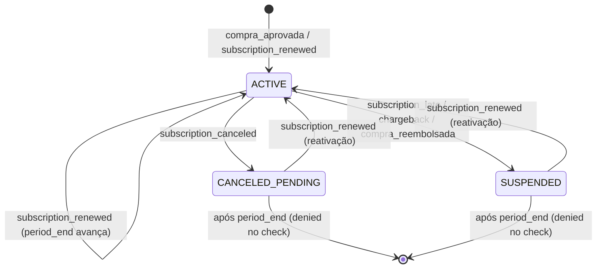

# Billing — Contratos e Políticas para Agentes

## Política de PII Redactor (RF-42)

O `PIIRedactor` (`application/services/pii_redactor.go`) substitui por `[REDACTED]` os seguintes paths no payload JSON:

- `customer.email`
- `customer.mobile`
- `customer.cpf`
- `card.*` (todos os subcampos)
- `payment.*.card.*` (todos os subcampos de card dentro de payment)

Nenhum outro campo é redactado. Campos não listados (ex: `product.id`, `tracking.src`) são preservados integralmente.

Aplicação: `AnonymizeWebhookEventsUseCase` chama `PIIRedactor.Strip(payload)` antes de persistir o payload anonimizado via `WebhookRepository.Anonymize`.

## Política de Grace Period (RF-44)

Após o evento `subscription_canceled`, a subscription transita para `CANCELED_PENDING`.

- `CheckEntitlementUseCase` retorna `granted` enquanto `now < period_end`.
- Após `period_end`, retorna `denied`.
- O grace period efetivo é controlado por `period_end` informado pelo provedor — não há offset fixo de 7 dias no código; a política de 7 dias é um SLA de negócio esperado do provedor.

## Política de Trust no Provider para period_end

O `period_end` recebido no payload do provedor (ex: Kiwify) é aceito sem ajuste local.
O domínio não recalcula nem valida o `period_end` — confia no provedor (trust provider).
Divergências entre o estado local e o provedor são detectadas pelo `ReconcileSubscriptionsUseCase`.

## Padrão de Locking Pessimista (CA-05)

`PgxSubscriptionRepository.FindActiveByUserIDForUpdate` usa `SELECT ... FOR UPDATE` dentro de uma `UnitOfWork[T]`.

Regra: qualquer mutação de estado de Subscription deve passar por `FindActiveByUserIDForUpdate` para evitar race conditions em processamento paralelo de webhooks do mesmo usuário.

## Máquina de Estados de Subscription

Transições não listadas são rejeitadas por `StateMachine.Apply` com `ErrInvalidTransition`.

## Fronteira Cross-Module (RF-45)

- `billing` importa `identity/domain` e `identity/application` — **nunca** `identity/infrastructure`.
- `UserResolver` (port em `application/interfaces`) abstrai o acesso ao agregado User.
- A implementação concreta de `UserResolver` fica em `infrastructure/` ou no wiring de `module.go`.

## Chave de Idempotência (CA-02)

`billing_event_applications(event_id, subscription_id)` tem UNIQUE constraint.
`WebhookRepository.RecordApplication` usa `ON CONFLICT DO NOTHING` — re-execuções são silenciosas.

## Anonimização (CA-12)

- `AnonymizeWebhookEventsUseCase` processa apenas eventos com `received_at < olderThan` e `anonymized_at IS NULL`.
- Idempotente: re-execução sobre linha já anonimizada não altera `anonymized_at`.
- Alvo padrão: eventos com mais de 365 dias.
